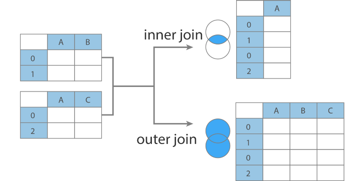

```python
# 필요 모듈 호출
import pandas as pd
import numpy as np
import random
```


```python
# 여러 변수 출력 코드
from IPython.core.interactiveshell import InteractiveShell
InteractiveShell.ast_node_interactivity = "all"
```


### 데이터프레임 병합 / 연결

- Pandas는 두 개 이상의 데이터프레임을 하나로 합치는
    - 병합(Merge)와 연결(Concate)을 지원함


#### merge 명령을 사용한 데이터 프레임 병합

- Merge : 
    - 두 개의 데이터 프레임의 공통 열이나 인덱스를 __기준__으로
    - 두 개의 데이터프레임을 합친다.
    - 이 때 기준이 되는 열 데이터를 key라고 부른다.


#### 형식
- df.merge(df1) : 두 df를 병합시켜 준다.
- 기본은 inner join : 양쪽에 동일하게 존재하는 키만 표시
- __key : 병합의 기준이 되는 열을 의미__
    -  실제 데이터 컬럼이나 행 인덱스 일 수 있다.
- 병합 방식
    - left join : 왼쪽 df에만 존재하는 키 데이터는 모두 표시, 오른쪽 df는 키가 중복 되면 표시
    - right join : 오른쪽 df에만 존재하는 키 데이터는 모두 표시, 왼쪽 df는 키가 중복 되면 표시
    - inner join :  양쪽 df에서 모두 키가 존재하는 data만표시
    - outer join :  한쪽에만 키가 존재해도 data를 표시
    - 병합 방식을 설정 : how = inner / how = outer (생략 가능)


```python
#예시 df 생성 - 고객 정보를 담고 있는 df
df1 =pd.DataFrame({
    '고객번호' : [1001,1002,1003,1004,1005,1006,1007],
    '이름' : ['둘리','도우너','또치','길동','희동','마이콜','영희']
        },
    columns=['고객번호','이름'])
df1

#예제 df 생성 - 예금 정보 df
df2 = pd.DataFrame({
    '고객번호':[1001,1001,1005,1006,1008,1001],
    '금액' : [10000,20000,15000,5000,100000,30000]
},columns=['고객번호','금액'])
df2
```


<div>
<style scoped>
    .dataframe tbody tr th:only-of-type {
        vertical-align: middle;
    }
</style>
<table border="1" class="dataframe">
  <thead>
    <tr style="text-align: right;">
      <th></th>
      <th>고객번호</th>
      <th>이름</th>
    </tr>
  </thead>
  <tbody>
    <tr>
      <th>0</th>
      <td>1001</td>
      <td>둘리</td>
    </tr>
    <tr>
      <th>1</th>
      <td>1002</td>
      <td>도우너</td>
    </tr>
    <tr>
      <th>2</th>
      <td>1003</td>
      <td>또치</td>
    </tr>
    <tr>
      <th>3</th>
      <td>1004</td>
      <td>길동</td>
    </tr>
    <tr>
      <th>4</th>
      <td>1005</td>
      <td>희동</td>
    </tr>
    <tr>
      <th>5</th>
      <td>1006</td>
      <td>마이콜</td>
    </tr>
    <tr>
      <th>6</th>
      <td>1007</td>
      <td>영희</td>
    </tr>
  </tbody>
</table>
</div>


<div>
<style scoped>
    .dataframe tbody tr th:only-of-type {
        vertical-align: middle;
    }
</style>
<table border="1" class="dataframe">
  <thead>
    <tr style="text-align: right;">
      <th></th>
      <th>고객번호</th>
      <th>금액</th>
    </tr>
  </thead>
  <tbody>
    <tr>
      <th>0</th>
      <td>1001</td>
      <td>10000</td>
    </tr>
    <tr>
      <th>1</th>
      <td>1001</td>
      <td>20000</td>
    </tr>
    <tr>
      <th>2</th>
      <td>1005</td>
      <td>15000</td>
    </tr>
    <tr>
      <th>3</th>
      <td>1006</td>
      <td>5000</td>
    </tr>
    <tr>
      <th>4</th>
      <td>1008</td>
      <td>100000</td>
    </tr>
    <tr>
      <th>5</th>
      <td>1001</td>
      <td>30000</td>
    </tr>
  </tbody>
</table>
</div>


### merge 명령으로 두 df를 병합하는 문법
 - 모든 인수 생략(병합 df를 제외한) 공통 이름을 갖고 있는 열
     - 따라서, '고객번호'가 키가 됨
 - 양쪽에 모두 존재하는 키의 data만 보여주는 inner join 방식을 사용


```python
df1.head(1)
df2.head(1)
```


<div>
<style scoped>
    .dataframe tbody tr th:only-of-type {
        vertical-align: middle;
    }
</style>
<table border="1" class="dataframe">
  <thead>
    <tr style="text-align: right;">
      <th></th>
      <th>고객번호</th>
      <th>이름</th>
    </tr>
  </thead>
  <tbody>
    <tr>
      <th>0</th>
      <td>1001</td>
      <td>둘리</td>
    </tr>
  </tbody>
</table>
</div>

<div>
<style scoped>
    .dataframe tbody tr th:only-of-type {
        vertical-align: middle;
    }

</style>
<table border="1" class="dataframe">
  <thead>
    <tr style="text-align: right;">
      <th></th>
      <th>고객번호</th>
      <th>금액</th>
    </tr>
  </thead>
  <tbody>
    <tr>
      <th>0</th>
      <td>1001</td>
      <td>10000</td>
    </tr>
  </tbody>
</table>
</div>


```python
# 방법 0 : df1.merge(df2)
# 이 경우에는 기준 데이터프레임이 df1

# 방법 1 : pd.merge(df1, df2) 
# 이 경우에는 기준 데이터프레임이 왼쪽 (df1)

df1.merge(df2)  # inner join 과 양쪽 df에서 열 이름이 같은 열을 키로 설정
# df1, df2의 고객번호 열에서 중복되는 데이터만 출력됨
```


<div>
<style scoped>
    .dataframe tbody tr th:only-of-type {
        vertical-align: middle;
    }
</style>
<table border="1" class="dataframe">
  <thead>
    <tr style="text-align: right;">
      <th></th>
      <th>고객번호</th>
      <th>이름</th>
      <th>금액</th>
    </tr>
  </thead>
  <tbody>
    <tr>
      <th>0</th>
      <td>1001</td>
      <td>둘리</td>
      <td>10000</td>
    </tr>
    <tr>
      <th>1</th>
      <td>1001</td>
      <td>둘리</td>
      <td>20000</td>
    </tr>
    <tr>
      <th>2</th>
      <td>1001</td>
      <td>둘리</td>
      <td>30000</td>
    </tr>
    <tr>
      <th>3</th>
      <td>1005</td>
      <td>희동</td>
      <td>15000</td>
    </tr>
    <tr>
      <th>4</th>
      <td>1006</td>
      <td>마이콜</td>
      <td>5000</td>
    </tr>
  </tbody>
</table>
</div>


```python
df1
df2
```


<div>
<style scoped>
    .dataframe tbody tr th:only-of-type {
        vertical-align: middle;
    }
</style>
<table border="1" class="dataframe">
  <thead>
    <tr style="text-align: right;">
      <th></th>
      <th>고객번호</th>
      <th>이름</th>
    </tr>
  </thead>
  <tbody>
    <tr>
      <th>0</th>
      <td>1001</td>
      <td>둘리</td>
    </tr>
    <tr>
      <th>1</th>
      <td>1002</td>
      <td>도우너</td>
    </tr>
    <tr>
      <th>2</th>
      <td>1003</td>
      <td>또치</td>
    </tr>
    <tr>
      <th>3</th>
      <td>1004</td>
      <td>길동</td>
    </tr>
    <tr>
      <th>4</th>
      <td>1005</td>
      <td>희동</td>
    </tr>
    <tr>
      <th>5</th>
      <td>1006</td>
      <td>마이콜</td>
    </tr>
    <tr>
      <th>6</th>
      <td>1007</td>
      <td>영희</td>
    </tr>
  </tbody>
</table>
</div>


<div>
<style scoped>
    .dataframe tbody tr th:only-of-type {
        vertical-align: middle;
    }
</style>
<table border="1" class="dataframe">
  <thead>
    <tr style="text-align: right;">
      <th></th>
      <th>고객번호</th>
      <th>금액</th>
    </tr>
  </thead>
  <tbody>
    <tr>
      <th>0</th>
      <td>1001</td>
      <td>10000</td>
    </tr>
    <tr>
      <th>1</th>
      <td>1001</td>
      <td>20000</td>
    </tr>
    <tr>
      <th>2</th>
      <td>1005</td>
      <td>15000</td>
    </tr>
    <tr>
      <th>3</th>
      <td>1006</td>
      <td>5000</td>
    </tr>
    <tr>
      <th>4</th>
      <td>1008</td>
      <td>100000</td>
    </tr>
    <tr>
      <th>5</th>
      <td>1001</td>
      <td>30000</td>
    </tr>
  </tbody>
</table>
</div>


- __outer join__ 방식은 키 값이 한 쪽에만 있어도 데이터를 보여줌
    - _pd.merge(df1,df2, how = 'outer')_
    - 어느 한 df에 데이터가 존재하지 않으면 NaN으로 표시됨


```python
pd.merge(df1,df2, how = 'outer')
# df1.merge(df2, how = 'outer') 이렇게 표기할 수도 있음
```


<div>
<style scoped>
    .dataframe tbody tr th:only-of-type {
        vertical-align: middle;
    }
</style>
<table border="1" class="dataframe">
  <thead>
    <tr style="text-align: right;">
      <th></th>
      <th>고객번호</th>
      <th>이름</th>
      <th>금액</th>
    </tr>
  </thead>
  <tbody>
    <tr>
      <th>0</th>
      <td>1001</td>
      <td>둘리</td>
      <td>10000.0</td>
    </tr>
    <tr>
      <th>1</th>
      <td>1001</td>
      <td>둘리</td>
      <td>20000.0</td>
    </tr>
    <tr>
      <th>2</th>
      <td>1001</td>
      <td>둘리</td>
      <td>30000.0</td>
    </tr>
    <tr>
      <th>3</th>
      <td>1002</td>
      <td>도우너</td>
      <td>NaN</td>
    </tr>
    <tr>
      <th>4</th>
      <td>1003</td>
      <td>또치</td>
      <td>NaN</td>
    </tr>
    <tr>
      <th>5</th>
      <td>1004</td>
      <td>길동</td>
      <td>NaN</td>
    </tr>
    <tr>
      <th>6</th>
      <td>1005</td>
      <td>희동</td>
      <td>15000.0</td>
    </tr>
    <tr>
      <th>7</th>
      <td>1006</td>
      <td>마이콜</td>
      <td>5000.0</td>
    </tr>
    <tr>
      <th>8</th>
      <td>1007</td>
      <td>영희</td>
      <td>NaN</td>
    </tr>
    <tr>
      <th>9</th>
      <td>1008</td>
      <td>NaN</td>
      <td>100000.0</td>
    </tr>
  </tbody>
</table>
</div>


#### how = inner/outer/left/right
- how=left : 왼쪽 df에 있는 모든 키의 데이터는 표시
- how=right : 오른쪽 df 에 있는 모든 키의 데이터는 표시


```python
pd.merge(df1,df2, how='left')
```


<div>
<style scoped>
    .dataframe tbody tr th:only-of-type {
        vertical-align: middle;
    }
</style>
<table border="1" class="dataframe">
  <thead>
    <tr style="text-align: right;">
      <th></th>
      <th>고객번호</th>
      <th>이름</th>
      <th>금액</th>
    </tr>
  </thead>
  <tbody>
    <tr>
      <th>0</th>
      <td>1001</td>
      <td>둘리</td>
      <td>10000.0</td>
    </tr>
    <tr>
      <th>1</th>
      <td>1001</td>
      <td>둘리</td>
      <td>20000.0</td>
    </tr>
    <tr>
      <th>2</th>
      <td>1001</td>
      <td>둘리</td>
      <td>30000.0</td>
    </tr>
    <tr>
      <th>3</th>
      <td>1002</td>
      <td>도우너</td>
      <td>NaN</td>
    </tr>
    <tr>
      <th>4</th>
      <td>1003</td>
      <td>또치</td>
      <td>NaN</td>
    </tr>
    <tr>
      <th>5</th>
      <td>1004</td>
      <td>길동</td>
      <td>NaN</td>
    </tr>
    <tr>
      <th>6</th>
      <td>1005</td>
      <td>희동</td>
      <td>15000.0</td>
    </tr>
    <tr>
      <th>7</th>
      <td>1006</td>
      <td>마이콜</td>
      <td>5000.0</td>
    </tr>
    <tr>
      <th>8</th>
      <td>1007</td>
      <td>영희</td>
      <td>NaN</td>
    </tr>
  </tbody>
</table>
</div>


```python
pd.merge(df1,df2, how='right')
```


<div>
<style scoped>
    .dataframe tbody tr th:only-of-type {
        vertical-align: middle;
    }
</style>
<table border="1" class="dataframe">
  <thead>
    <tr style="text-align: right;">
      <th></th>
      <th>고객번호</th>
      <th>이름</th>
      <th>금액</th>
    </tr>
  </thead>
  <tbody>
    <tr>
      <th>0</th>
      <td>1001</td>
      <td>둘리</td>
      <td>10000</td>
    </tr>
    <tr>
      <th>1</th>
      <td>1001</td>
      <td>둘리</td>
      <td>20000</td>
    </tr>
    <tr>
      <th>2</th>
      <td>1005</td>
      <td>희동</td>
      <td>15000</td>
    </tr>
    <tr>
      <th>3</th>
      <td>1006</td>
      <td>마이콜</td>
      <td>5000</td>
    </tr>
    <tr>
      <th>4</th>
      <td>1008</td>
      <td>NaN</td>
      <td>100000</td>
    </tr>
    <tr>
      <th>5</th>
      <td>1001</td>
      <td>둘리</td>
      <td>30000</td>
    </tr>
  </tbody>
</table>
</div>


- 동일한 키 값이 있는 경우
    - 키값이 같은 데이터가 여러개 있는 경우에는 있을 수 있는 모든 경우의 수를 따져서 조합을 만들어 낸다.


```python
#예제 df 생성 
#열: 품종, 꽃잎길이
df1 = pd.DataFrame({
    '품종':['setosa','setosa','virginica','virginica'],
    '꽃잎길이':[1.4,1.3,1.5,1.3]
}, columns=['품종','꽃잎길이'])
df1

#열 : 품종, 꽃잎너비
df2 = pd.DataFrame({
    '품종': ['setosa','virginica','virginica','ersicolor'],
    '꽃잎너비':[0.4,0.3,0.5,0.3]
},columns=['품종','꽃잎너비'])
df2
```


<div>
<style scoped>
    .dataframe tbody tr th:only-of-type {
        vertical-align: middle;
    }
</style>
<table border="1" class="dataframe">
  <thead>
    <tr style="text-align: right;">
      <th></th>
      <th>품종</th>
      <th>꽃잎길이</th>
    </tr>
  </thead>
  <tbody>
    <tr>
      <th>0</th>
      <td>setosa</td>
      <td>1.4</td>
    </tr>
    <tr>
      <th>1</th>
      <td>setosa</td>
      <td>1.3</td>
    </tr>
    <tr>
      <th>2</th>
      <td>virginica</td>
      <td>1.5</td>
    </tr>
    <tr>
      <th>3</th>
      <td>virginica</td>
      <td>1.3</td>
    </tr>
  </tbody>
</table>
</div>


<div>
<style scoped>
    .dataframe tbody tr th:only-of-type {
        vertical-align: middle;
    }
</style>
<table border="1" class="dataframe">
  <thead>
    <tr style="text-align: right;">
      <th></th>
      <th>품종</th>
      <th>꽃잎너비</th>
    </tr>
  </thead>
  <tbody>
    <tr>
      <th>0</th>
      <td>setosa</td>
      <td>0.4</td>
    </tr>
    <tr>
      <th>1</th>
      <td>virginica</td>
      <td>0.3</td>
    </tr>
    <tr>
      <th>2</th>
      <td>virginica</td>
      <td>0.5</td>
    </tr>
    <tr>
      <th>3</th>
      <td>ersicolor</td>
      <td>0.3</td>
    </tr>
  </tbody>
</table>
</div>


- df1과 df2 를 병합
    - 위 데이터에서 키 값 setosa에 대해
        - df1에는 1.4와 1.3 2개의 데이터가 있고
        - df2에는 0.4라는 1개의 데이터가 있으므로
    - 병합 데이터에는 setosa가 (1.4,0.4)(1.3,0.4)의 2 경우가 표현된다.
      
    - 키값 virginica의 경우에는 df1에 2개 df2에 2개의 데이터가 있으므로
    - 2개와 2개의 조합에 의해 4개의 데이터가 표현된다.


```python
pd.merge(df1,df2)
```


<div>
<style scoped>
    .dataframe tbody tr th:only-of-type {
        vertical-align: middle;
    }
</style>
<table border="1" class="dataframe">
  <thead>
    <tr style="text-align: right;">
      <th></th>
      <th>품종</th>
      <th>꽃잎길이</th>
      <th>꽃잎너비</th>
    </tr>
  </thead>
  <tbody>
    <tr>
      <th>0</th>
      <td>setosa</td>
      <td>1.4</td>
      <td>0.4</td>
    </tr>
    <tr>
      <th>1</th>
      <td>setosa</td>
      <td>1.3</td>
      <td>0.4</td>
    </tr>
    <tr>
      <th>2</th>
      <td>virginica</td>
      <td>1.5</td>
      <td>0.3</td>
    </tr>
    <tr>
      <th>3</th>
      <td>virginica</td>
      <td>1.5</td>
      <td>0.5</td>
    </tr>
    <tr>
      <th>4</th>
      <td>virginica</td>
      <td>1.3</td>
      <td>0.3</td>
    </tr>
    <tr>
      <th>5</th>
      <td>virginica</td>
      <td>1.3</td>
      <td>0.5</td>
    </tr>
  </tbody>
</table>
</div>


#### 병합(merge) 시 key에 대한 설명
- 두 데이터프레임에서 열 이름(컬럼명)이 같은 모든 컬럼은 Key가 될 수 있음
- 이름이 같아도 키로 설정하지 않아야 하는 열이 있으면 기준열 명시
    - __on__ 파라미터의 인수를 설정


```python
# 예제 df
df1 = pd.DataFrame({
    '고객명':['춘향','춘향','몽룡'],
    '날짜' : ['2018-01-01','2018-01-02','2018-01-01'],
    '데이터':[20000,30000,100000]
})
df1

df2 = pd.DataFrame({
    '고객명':['춘향','몽룡'],
    '데이터':['여자','남자']
})
df2

# df1과 df2에 동일한 컬럼명이 존재('고객명', '데이터')
# 그 중 데이터 컬럼은 원소의 의미가 다름(키로 사용하면 안 됨!!!)
# 병합 시 직접 key(기준 열)을 명시해야 함
```


<div>
<style scoped>
    .dataframe tbody tr th:only-of-type {
        vertical-align: middle;
    }
</style>
<table border="1" class="dataframe">
  <thead>
    <tr style="text-align: right;">
      <th></th>
      <th>고객명</th>
      <th>날짜</th>
      <th>데이터</th>
    </tr>
  </thead>
  <tbody>
    <tr>
      <th>0</th>
      <td>춘향</td>
      <td>2018-01-01</td>
      <td>20000</td>
    </tr>
    <tr>
      <th>1</th>
      <td>춘향</td>
      <td>2018-01-02</td>
      <td>30000</td>
    </tr>
    <tr>
      <th>2</th>
      <td>몽룡</td>
      <td>2018-01-01</td>
      <td>100000</td>
    </tr>
  </tbody>
</table>
</div>


<div>
<style scoped>
    .dataframe tbody tr th:only-of-type {
        vertical-align: middle;
    }
</style>
<table border="1" class="dataframe">
  <thead>
    <tr style="text-align: right;">
      <th></th>
      <th>고객명</th>
      <th>데이터</th>
    </tr>
  </thead>
  <tbody>
    <tr>
      <th>0</th>
      <td>춘향</td>
      <td>여자</td>
    </tr>
    <tr>
      <th>1</th>
      <td>몽룡</td>
      <td>남자</td>
    </tr>
  </tbody>
</table>
</div>


- 기준열을 직접 지정 : __on = 기준열 이름__
    - 반환 결과 키가 아닌 열에 동일 필드명이 있을 경우에는 필드명_x, 필드명_y로 필드명을 변경해서 표현


```python
# pd.merge(df1, df2)
# 데이터 타입도 다르고, 키도 2개가 나타나기 때문에 에러 발생

pd.merge(df1, df2, on = '고객명')
```


<div>
<style scoped>
    .dataframe tbody tr th:only-of-type {
        vertical-align: middle;
    }
</style>
<table border="1" class="dataframe">
  <thead>
    <tr style="text-align: right;">
      <th></th>
      <th>고객명</th>
      <th>날짜</th>
      <th>데이터_x</th>
      <th>데이터_y</th>
    </tr>
  </thead>
  <tbody>
    <tr>
      <th>0</th>
      <td>춘향</td>
      <td>2018-01-01</td>
      <td>20000</td>
      <td>여자</td>
    </tr>
    <tr>
      <th>1</th>
      <td>춘향</td>
      <td>2018-01-02</td>
      <td>30000</td>
      <td>여자</td>
    </tr>
    <tr>
      <th>2</th>
      <td>몽룡</td>
      <td>2018-01-01</td>
      <td>100000</td>
      <td>남자</td>
    </tr>
  </tbody>
</table>
</div>


- 키가 되는 기준열이 두 데이터 프레임에서 _다르게 나타나면_
    - __left_on, right_on 인수를 사용해서 기준열을 명시해야 함__


```python
df1=pd.DataFrame({
    '이름' :['영희','철수','철수'],
    '성적' :[90,80,80]
})
df2 = pd.DataFrame({
    '성명' :['영희','영희','철수'],
    '성적2':[100,80,90]
})
df1.head(1)
df2.head(1)
```


<div>
<style scoped>
    .dataframe tbody tr th:only-of-type {
        vertical-align: middle;
    }
</style>
<table border="1" class="dataframe">
  <thead>
    <tr style="text-align: right;">
      <th></th>
      <th>이름</th>
      <th>성적</th>
    </tr>
  </thead>
  <tbody>
    <tr>
      <th>0</th>
      <td>영희</td>
      <td>90</td>
    </tr>
  </tbody>
</table>
</div>


<div>
<style scoped>
    .dataframe tbody tr th:only-of-type {
        vertical-align: middle;
    }
</style>
<table border="1" class="dataframe">
  <thead>
    <tr style="text-align: right;">
      <th></th>
      <th>성명</th>
      <th>성적2</th>
    </tr>
  </thead>
  <tbody>
    <tr>
      <th>0</th>
      <td>영희</td>
      <td>100</td>
    </tr>
  </tbody>
</table>
</div>


```python
pd.merge(df1, df2, left_on='이름', right_on='성명')
# 여기서 left에 해당하는 데이터프레임은 df1

# 양쪽에서 기준이 되는 열의 이름이 다르기 때문에 on인수를 두 번 사용
# 출력결과는 양쪽 df의 기준 열 이름이 다르기 때문에 기준 열이 모두 나타난다.

```


<div>
<style scoped>
    .dataframe tbody tr th:only-of-type {
        vertical-align: middle;
    }
</style>
<table border="1" class="dataframe">
  <thead>
    <tr style="text-align: right;">
      <th></th>
      <th>이름</th>
      <th>성적</th>
      <th>성명</th>
      <th>성적2</th>
    </tr>
  </thead>
  <tbody>
    <tr>
      <th>0</th>
      <td>영희</td>
      <td>90</td>
      <td>영희</td>
      <td>100</td>
    </tr>
    <tr>
      <th>1</th>
      <td>영희</td>
      <td>90</td>
      <td>영희</td>
      <td>80</td>
    </tr>
    <tr>
      <th>2</th>
      <td>철수</td>
      <td>80</td>
      <td>철수</td>
      <td>90</td>
    </tr>
    <tr>
      <th>3</th>
      <td>철수</td>
      <td>80</td>
      <td>철수</td>
      <td>90</td>
    </tr>
  </tbody>
</table>
</div>


- 일반 데이터 열이 아닌 인덱스를 기준으로 merge 할 수 도 있음
    - 인덱스를 기준열로 사용하려면
        - left_index = True 또는
        - right_index = True 설정을 하게 됨


```python
# 예제 데이터프레임

df1 = pd.DataFrame({
    '도시': ['서울','서울','서울','부산','부산'],
    '연도': [2000,2005,2010,2000,2005],
    '인구':[9853972,9762546,9631482,3655437,3512547]    
})
df2=pd.DataFrame(
    np.arange(12).reshape((6,2)),
    index=[['부산','부산','서울','서울','서울','서울'],
          [2000,2005,2000,2005,2010,2015]],
    columns=['데이터1','데이터2']
)
# df2 는 다중인덱스 소유

df1
df2
```


<div>
<style scoped>
    .dataframe tbody tr th:only-of-type {
        vertical-align: middle;
    }
</style>
<table border="1" class="dataframe">
  <thead>
    <tr style="text-align: right;">
      <th></th>
      <th>도시</th>
      <th>연도</th>
      <th>인구</th>
    </tr>
  </thead>
  <tbody>
    <tr>
      <th>0</th>
      <td>서울</td>
      <td>2000</td>
      <td>9853972</td>
    </tr>
    <tr>
      <th>1</th>
      <td>서울</td>
      <td>2005</td>
      <td>9762546</td>
    </tr>
    <tr>
      <th>2</th>
      <td>서울</td>
      <td>2010</td>
      <td>9631482</td>
    </tr>
    <tr>
      <th>3</th>
      <td>부산</td>
      <td>2000</td>
      <td>3655437</td>
    </tr>
    <tr>
      <th>4</th>
      <td>부산</td>
      <td>2005</td>
      <td>3512547</td>
    </tr>
  </tbody>
</table>
</div>


<div>
<style scoped>
    .dataframe tbody tr th:only-of-type {
        vertical-align: middle;
    }
</style>
<table border="1" class="dataframe">
  <thead>
    <tr style="text-align: right;">
      <th></th>
      <th></th>
      <th>데이터1</th>
      <th>데이터2</th>
    </tr>
  </thead>
  <tbody>
    <tr>
      <th rowspan="2" valign="top">부산</th>
      <th>2000</th>
      <td>0</td>
      <td>1</td>
    </tr>
    <tr>
      <th>2005</th>
      <td>2</td>
      <td>3</td>
    </tr>
    <tr>
      <th rowspan="4" valign="top">서울</th>
      <th>2000</th>
      <td>4</td>
      <td>5</td>
    </tr>
    <tr>
      <th>2005</th>
      <td>6</td>
      <td>7</td>
    </tr>
    <tr>
      <th>2010</th>
      <td>8</td>
      <td>9</td>
    </tr>
    <tr>
      <th>2015</th>
      <td>10</td>
      <td>11</td>
    </tr>
  </tbody>
</table>
</div>


```python
pd.merge(df1,df2, left_on = ['도시', '연도'], right_index = True)
# 왼쪽의 df1는 '도시'와 '연도'열이 기준열, 오른쪽의 df2는 인덱스를 기준으로 병합
```


<div>
<style scoped>
    .dataframe tbody tr th:only-of-type {
        vertical-align: middle;
    }
</style>
<table border="1" class="dataframe">
  <thead>
    <tr style="text-align: right;">
      <th></th>
      <th>도시</th>
      <th>연도</th>
      <th>인구</th>
      <th>데이터1</th>
      <th>데이터2</th>
    </tr>
  </thead>
  <tbody>
    <tr>
      <th>0</th>
      <td>서울</td>
      <td>2000</td>
      <td>9853972</td>
      <td>4</td>
      <td>5</td>
    </tr>
    <tr>
      <th>1</th>
      <td>서울</td>
      <td>2005</td>
      <td>9762546</td>
      <td>6</td>
      <td>7</td>
    </tr>
    <tr>
      <th>2</th>
      <td>서울</td>
      <td>2010</td>
      <td>9631482</td>
      <td>8</td>
      <td>9</td>
    </tr>
    <tr>
      <th>3</th>
      <td>부산</td>
      <td>2000</td>
      <td>3655437</td>
      <td>0</td>
      <td>1</td>
    </tr>
    <tr>
      <th>4</th>
      <td>부산</td>
      <td>2005</td>
      <td>3512547</td>
      <td>2</td>
      <td>3</td>
    </tr>
  </tbody>
</table>
</div>


- 양쪽 데이터프레임의 key(기준열)가 모두 인덱스인 경우
    - right_index = True, left_index = True 로 설정 가능


```python
df1 = pd.DataFrame(
[[1.,2.],[3.,4.],[5.,6.]],
index=['a','c','e'],
columns=['서울','부산'])
df1

df2=pd.DataFrame(
[[7.,8.],[9.,10.],[11.,12.],[13.,14.]],
    index=['b','c','d','e'],
columns=['대구','광주'])
df2
```


<div>
<style scoped>
    .dataframe tbody tr th:only-of-type {
        vertical-align: middle;
    }
</style>
<table border="1" class="dataframe">
  <thead>
    <tr style="text-align: right;">
      <th></th>
      <th>서울</th>
      <th>부산</th>
    </tr>
  </thead>
  <tbody>
    <tr>
      <th>a</th>
      <td>1.0</td>
      <td>2.0</td>
    </tr>
    <tr>
      <th>c</th>
      <td>3.0</td>
      <td>4.0</td>
    </tr>
    <tr>
      <th>e</th>
      <td>5.0</td>
      <td>6.0</td>
    </tr>
  </tbody>
</table>
</div>


<div>
<style scoped>
    .dataframe tbody tr th:only-of-type {
        vertical-align: middle;
    }
</style>
<table border="1" class="dataframe">
  <thead>
    <tr style="text-align: right;">
      <th></th>
      <th>대구</th>
      <th>광주</th>
    </tr>
  </thead>
  <tbody>
    <tr>
      <th>b</th>
      <td>7.0</td>
      <td>8.0</td>
    </tr>
    <tr>
      <th>c</th>
      <td>9.0</td>
      <td>10.0</td>
    </tr>
    <tr>
      <th>d</th>
      <td>11.0</td>
      <td>12.0</td>
    </tr>
    <tr>
      <th>e</th>
      <td>13.0</td>
      <td>14.0</td>
    </tr>
  </tbody>
</table>
</div>


```python
pd.merge(df1, df2, how='outer', left_index=True, right_index=True)
```


<div>
<style scoped>
    .dataframe tbody tr th:only-of-type {
        vertical-align: middle;
    }
</style>
<table border="1" class="dataframe">
  <thead>
    <tr style="text-align: right;">
      <th></th>
      <th>서울</th>
      <th>부산</th>
      <th>대구</th>
      <th>광주</th>
    </tr>
  </thead>
  <tbody>
    <tr>
      <th>a</th>
      <td>1.0</td>
      <td>2.0</td>
      <td>NaN</td>
      <td>NaN</td>
    </tr>
    <tr>
      <th>b</th>
      <td>NaN</td>
      <td>NaN</td>
      <td>7.0</td>
      <td>8.0</td>
    </tr>
    <tr>
      <th>c</th>
      <td>3.0</td>
      <td>4.0</td>
      <td>9.0</td>
      <td>10.0</td>
    </tr>
    <tr>
      <th>d</th>
      <td>NaN</td>
      <td>NaN</td>
      <td>11.0</td>
      <td>12.0</td>
    </tr>
    <tr>
      <th>e</th>
      <td>5.0</td>
      <td>6.0</td>
      <td>13.0</td>
      <td>14.0</td>
    </tr>
  </tbody>
</table>
</div>


- merge 함수 대신 join 사용 가능


```python
df1.join(df2)
```


<div>
<style scoped>
    .dataframe tbody tr th:only-of-type {
        vertical-align: middle;
    }
</style>
<table border="1" class="dataframe">
  <thead>
    <tr style="text-align: right;">
      <th></th>
      <th>서울</th>
      <th>부산</th>
      <th>대구</th>
      <th>광주</th>
    </tr>
  </thead>
  <tbody>
    <tr>
      <th>a</th>
      <td>1.0</td>
      <td>2.0</td>
      <td>NaN</td>
      <td>NaN</td>
    </tr>
    <tr>
      <th>c</th>
      <td>3.0</td>
      <td>4.0</td>
      <td>9.0</td>
      <td>10.0</td>
    </tr>
    <tr>
      <th>e</th>
      <td>5.0</td>
      <td>6.0</td>
      <td>13.0</td>
      <td>14.0</td>
    </tr>
  </tbody>
</table>
</div>


### concat 명령을 사용한 데이터 연결

     pd.concat(objs,  # Series, DataFrame, Panel object  
        axis=0,  # 0: 위+아래로 합치기, 1: 왼쪽+오른쪽으로 합치기   
        join='outer', # 'outer': 합집합(union), 'inner': 교집합(intersection)  
        ignore_index=False,  # False: 기존 index 유지, True: 기존 index 무시 
        keys=None, # 계층적 index 사용하려면 keys 튜플 입력) 


- concat 명령을 사용하면 기준열 없이 데이터를 연결한다.
- 기본은 위 아래로 데이터 행 결합(row bind)  axis 속성을 1로 설정하면 열 결합(column bind)을 수행한다

- 단순히 두 시리즈나 데이터프레임을 연결하기 때문에 _인덱스 값이 중복될 수 있다._

#### pd.concat([df1,df2],axis=0) 행 결합


#### pd.concat([df1,df2],axis=1) 열 결합


```python
# 예제 시리즈
#두 시리즈 데이터 연결
s1=pd.Series([0,1],index=['A','B'])
s2=pd.Series([2,3,4],index=['A','B','C'])
s1
s2
```


    A    0
    B    1
    dtype: int64


    A    2
    B    3
    C    4
    dtype: int64


```python
pd.concat([s1,s2])
```


    A    0
    B    1
    A    2
    B    3
    C    4
    dtype: int64


##### 데이터프레임 결합


```python
# concat 연결 예제 df
df1 = pd.DataFrame({'A': ['A0', 'A1', 'A2', 'A3'], 
                    'B': ['B0', 'B1', 'B2', 'B3'],
                    'C': ['C0', 'C1', 'C2', 'C3'],
                    'D': ['D0', 'D1', 'D2', 'D3']},
                   index=[0, 1, 2, 3])

df2 = pd.DataFrame({'A': ['A4', 'A5', 'A6', 'A7'],
                    'B': ['B4', 'B5', 'B6', 'B7'],
                    'E': ['C4', 'C5', 'C6', 'C7'],
                    'F': ['D4', 'D5', 'D6', 'D7']},
                   index=[0, 1, 2, 3])

df3 = pd.DataFrame({'A': ['A8', 'A9', 'A10', 'A11'],
                    'B': ['B8', 'B9', 'B10', 'B11'],
                    'C': ['C8', 'C9', 'C10', 'C11'],
                    'O': ['D8', 'D9', 'D10', 'D11']},
                   index=[1,2,3,4])
df1
df2
df3
```


<div>
<style scoped>
    .dataframe tbody tr th:only-of-type {
        vertical-align: middle;
    }
</style>
<table border="1" class="dataframe">
  <thead>
    <tr style="text-align: right;">
      <th></th>
      <th>A</th>
      <th>B</th>
      <th>C</th>
      <th>D</th>
    </tr>
  </thead>
  <tbody>
    <tr>
      <th>0</th>
      <td>A0</td>
      <td>B0</td>
      <td>C0</td>
      <td>D0</td>
    </tr>
    <tr>
      <th>1</th>
      <td>A1</td>
      <td>B1</td>
      <td>C1</td>
      <td>D1</td>
    </tr>
    <tr>
      <th>2</th>
      <td>A2</td>
      <td>B2</td>
      <td>C2</td>
      <td>D2</td>
    </tr>
    <tr>
      <th>3</th>
      <td>A3</td>
      <td>B3</td>
      <td>C3</td>
      <td>D3</td>
    </tr>
  </tbody>
</table>
</div>

<div>
<style scoped>
    .dataframe tbody tr th:only-of-type {
        vertical-align: middle;
    }

</style>
<table border="1" class="dataframe">
  <thead>
    <tr style="text-align: right;">
      <th></th>
      <th>A</th>
      <th>B</th>
      <th>E</th>
      <th>F</th>
    </tr>
  </thead>
  <tbody>
    <tr>
      <th>0</th>
      <td>A4</td>
      <td>B4</td>
      <td>C4</td>
      <td>D4</td>
    </tr>
    <tr>
      <th>1</th>
      <td>A5</td>
      <td>B5</td>
      <td>C5</td>
      <td>D5</td>
    </tr>
    <tr>
      <th>2</th>
      <td>A6</td>
      <td>B6</td>
      <td>C6</td>
      <td>D6</td>
    </tr>
    <tr>
      <th>3</th>
      <td>A7</td>
      <td>B7</td>
      <td>C7</td>
      <td>D7</td>
    </tr>
  </tbody>
</table>
</div>


<div>
<style scoped>
    .dataframe tbody tr th:only-of-type {
        vertical-align: middle;
    }
</style>
<table border="1" class="dataframe">
  <thead>
    <tr style="text-align: right;">
      <th></th>
      <th>A</th>
      <th>B</th>
      <th>C</th>
      <th>O</th>
    </tr>
  </thead>
  <tbody>
    <tr>
      <th>1</th>
      <td>A8</td>
      <td>B8</td>
      <td>C8</td>
      <td>D8</td>
    </tr>
    <tr>
      <th>2</th>
      <td>A9</td>
      <td>B9</td>
      <td>C9</td>
      <td>D9</td>
    </tr>
    <tr>
      <th>3</th>
      <td>A10</td>
      <td>B10</td>
      <td>C10</td>
      <td>D10</td>
    </tr>
    <tr>
      <th>4</th>
      <td>A11</td>
      <td>B11</td>
      <td>C11</td>
      <td>D11</td>
    </tr>
  </tbody>
</table>
</div>


```python
# concat() : join 인수 생략은 'outer'와 같다

result = pd.concat([df1, df2])
result = pd.concat([df1, df2], axis=0, join = 'outer') # axis=0, join='outer'가 기본값
result
```


<div>
<style scoped>
    .dataframe tbody tr th:only-of-type {
        vertical-align: middle;
    }
</style>
<table border="1" class="dataframe">
  <thead>
    <tr style="text-align: right;">
      <th></th>
      <th>A</th>
      <th>B</th>
      <th>C</th>
      <th>D</th>
      <th>E</th>
      <th>F</th>
    </tr>
  </thead>
  <tbody>
    <tr>
      <th>0</th>
      <td>A0</td>
      <td>B0</td>
      <td>C0</td>
      <td>D0</td>
      <td>NaN</td>
      <td>NaN</td>
    </tr>
    <tr>
      <th>1</th>
      <td>A1</td>
      <td>B1</td>
      <td>C1</td>
      <td>D1</td>
      <td>NaN</td>
      <td>NaN</td>
    </tr>
    <tr>
      <th>2</th>
      <td>A2</td>
      <td>B2</td>
      <td>C2</td>
      <td>D2</td>
      <td>NaN</td>
      <td>NaN</td>
    </tr>
    <tr>
      <th>3</th>
      <td>A3</td>
      <td>B3</td>
      <td>C3</td>
      <td>D3</td>
      <td>NaN</td>
      <td>NaN</td>
    </tr>
    <tr>
      <th>0</th>
      <td>A4</td>
      <td>B4</td>
      <td>NaN</td>
      <td>NaN</td>
      <td>C4</td>
      <td>D4</td>
    </tr>
    <tr>
      <th>1</th>
      <td>A5</td>
      <td>B5</td>
      <td>NaN</td>
      <td>NaN</td>
      <td>C5</td>
      <td>D5</td>
    </tr>
    <tr>
      <th>2</th>
      <td>A6</td>
      <td>B6</td>
      <td>NaN</td>
      <td>NaN</td>
      <td>C6</td>
      <td>D6</td>
    </tr>
    <tr>
      <th>3</th>
      <td>A7</td>
      <td>B7</td>
      <td>NaN</td>
      <td>NaN</td>
      <td>C7</td>
      <td>D7</td>
    </tr>
  </tbody>
</table>
</div>


```python
# result 데이터프레임의 인덱스가 중복되어 있음 : 행 인덱싱을 수행하면?

result.loc[0] # 인덱스가 0인 모든 행을 추출
```


<div>
<style scoped>
    .dataframe tbody tr th:only-of-type {
        vertical-align: middle;
    }
</style>
<table border="1" class="dataframe">
  <thead>
    <tr style="text-align: right;">
      <th></th>
      <th>A</th>
      <th>B</th>
      <th>C</th>
      <th>D</th>
      <th>E</th>
      <th>F</th>
    </tr>
  </thead>
  <tbody>
    <tr>
      <th>0</th>
      <td>A0</td>
      <td>B0</td>
      <td>C0</td>
      <td>D0</td>
      <td>NaN</td>
      <td>NaN</td>
    </tr>
    <tr>
      <th>0</th>
      <td>A4</td>
      <td>B4</td>
      <td>NaN</td>
      <td>NaN</td>
      <td>C4</td>
      <td>D4</td>
    </tr>
  </tbody>
</table>
</div>


```python
# 인덱스가 중복되므로 기본 인덱스로 재설정
# reset_index(drop=True) - 기존 인덱스 제거
result = result.reset_index(drop=True)
result
```


<div>
<style scoped>
    .dataframe tbody tr th:only-of-type {
        vertical-align: middle;
    }
</style>
<table border="1" class="dataframe">
  <thead>
    <tr style="text-align: right;">
      <th></th>
      <th>A</th>
      <th>B</th>
      <th>C</th>
      <th>D</th>
      <th>E</th>
      <th>F</th>
    </tr>
  </thead>
  <tbody>
    <tr>
      <th>0</th>
      <td>A0</td>
      <td>B0</td>
      <td>C0</td>
      <td>D0</td>
      <td>NaN</td>
      <td>NaN</td>
    </tr>
    <tr>
      <th>1</th>
      <td>A1</td>
      <td>B1</td>
      <td>C1</td>
      <td>D1</td>
      <td>NaN</td>
      <td>NaN</td>
    </tr>
    <tr>
      <th>2</th>
      <td>A2</td>
      <td>B2</td>
      <td>C2</td>
      <td>D2</td>
      <td>NaN</td>
      <td>NaN</td>
    </tr>
    <tr>
      <th>3</th>
      <td>A3</td>
      <td>B3</td>
      <td>C3</td>
      <td>D3</td>
      <td>NaN</td>
      <td>NaN</td>
    </tr>
    <tr>
      <th>4</th>
      <td>A4</td>
      <td>B4</td>
      <td>NaN</td>
      <td>NaN</td>
      <td>C4</td>
      <td>D4</td>
    </tr>
    <tr>
      <th>5</th>
      <td>A5</td>
      <td>B5</td>
      <td>NaN</td>
      <td>NaN</td>
      <td>C5</td>
      <td>D5</td>
    </tr>
    <tr>
      <th>6</th>
      <td>A6</td>
      <td>B6</td>
      <td>NaN</td>
      <td>NaN</td>
      <td>C6</td>
      <td>D6</td>
    </tr>
    <tr>
      <th>7</th>
      <td>A7</td>
      <td>B7</td>
      <td>NaN</td>
      <td>NaN</td>
      <td>C7</td>
      <td>D7</td>
    </tr>
  </tbody>
</table>
</div>


- join = 'inner' : 공통열만 표현


```python
result0 = pd.concat([df1, df2], join = 'inner') # 두 df의 공통 열만 추출
result0
```


<div>
<style scoped>
    .dataframe tbody tr th:only-of-type {
        vertical-align: middle;
    }
</style>
<table border="1" class="dataframe">
  <thead>
    <tr style="text-align: right;">
      <th></th>
      <th>A</th>
      <th>B</th>
    </tr>
  </thead>
  <tbody>
    <tr>
      <th>0</th>
      <td>A0</td>
      <td>B0</td>
    </tr>
    <tr>
      <th>1</th>
      <td>A1</td>
      <td>B1</td>
    </tr>
    <tr>
      <th>2</th>
      <td>A2</td>
      <td>B2</td>
    </tr>
    <tr>
      <th>3</th>
      <td>A3</td>
      <td>B3</td>
    </tr>
    <tr>
      <th>0</th>
      <td>A4</td>
      <td>B4</td>
    </tr>
    <tr>
      <th>1</th>
      <td>A5</td>
      <td>B5</td>
    </tr>
    <tr>
      <th>2</th>
      <td>A6</td>
      <td>B6</td>
    </tr>
    <tr>
      <th>3</th>
      <td>A7</td>
      <td>B7</td>
    </tr>
  </tbody>
</table>
</div>


- ignore_index = True : 기존 인덱스 제거 후 제로베이스 인덱스 설정


```python
result0 = pd.concat([df1, df2], join = 'inner', ignore_index = True)
result0
```


<div>
<style scoped>
    .dataframe tbody tr th:only-of-type {
        vertical-align: middle;
    }
</style>

<table border="1" class="dataframe">
  <thead>
    <tr style="text-align: right;">
      <th></th>
      <th>A</th>
      <th>B</th>
    </tr>
  </thead>
  <tbody>
    <tr>
      <th>0</th>
      <td>A0</td>
      <td>B0</td>
    </tr>
    <tr>
      <th>1</th>
      <td>A1</td>
      <td>B1</td>
    </tr>
    <tr>
      <th>2</th>
      <td>A2</td>
      <td>B2</td>
    </tr>
    <tr>
      <th>3</th>
      <td>A3</td>
      <td>B3</td>
    </tr>
    <tr>
      <th>4</th>
      <td>A4</td>
      <td>B4</td>
    </tr>
    <tr>
      <th>5</th>
      <td>A5</td>
      <td>B5</td>
    </tr>
    <tr>
      <th>6</th>
      <td>A6</td>
      <td>B6</td>
    </tr>
    <tr>
      <th>7</th>
      <td>A7</td>
      <td>B7</td>
    </tr>
  </tbody>
</table>
</div>


- keys=[상위인덱스1, 상위인덱스2, ...] : 상위레벨 인덱스 설정하는 파라미터


```python
result1 = pd.concat([df1, df2, df3], keys=['df1','df2','df3'])
result1
```


<div>
<style scoped>
    .dataframe tbody tr th:only-of-type {
        vertical-align: middle;
    }
</style>
<table border="1" class="dataframe">
  <thead>
    <tr style="text-align: right;">
      <th></th>
      <th></th>
      <th>A</th>
      <th>B</th>
      <th>C</th>
      <th>D</th>
      <th>E</th>
      <th>F</th>
      <th>O</th>
    </tr>
  </thead>
  <tbody>
    <tr>
      <th rowspan="4" valign="top">df1</th>
      <th>0</th>
      <td>A0</td>
      <td>B0</td>
      <td>C0</td>
      <td>D0</td>
      <td>NaN</td>
      <td>NaN</td>
      <td>NaN</td>
    </tr>
    <tr>
      <th>1</th>
      <td>A1</td>
      <td>B1</td>
      <td>C1</td>
      <td>D1</td>
      <td>NaN</td>
      <td>NaN</td>
      <td>NaN</td>
    </tr>
    <tr>
      <th>2</th>
      <td>A2</td>
      <td>B2</td>
      <td>C2</td>
      <td>D2</td>
      <td>NaN</td>
      <td>NaN</td>
      <td>NaN</td>
    </tr>
    <tr>
      <th>3</th>
      <td>A3</td>
      <td>B3</td>
      <td>C3</td>
      <td>D3</td>
      <td>NaN</td>
      <td>NaN</td>
      <td>NaN</td>
    </tr>
    <tr>
      <th rowspan="4" valign="top">df2</th>
      <th>0</th>
      <td>A4</td>
      <td>B4</td>
      <td>NaN</td>
      <td>NaN</td>
      <td>C4</td>
      <td>D4</td>
      <td>NaN</td>
    </tr>
    <tr>
      <th>1</th>
      <td>A5</td>
      <td>B5</td>
      <td>NaN</td>
      <td>NaN</td>
      <td>C5</td>
      <td>D5</td>
      <td>NaN</td>
    </tr>
    <tr>
      <th>2</th>
      <td>A6</td>
      <td>B6</td>
      <td>NaN</td>
      <td>NaN</td>
      <td>C6</td>
      <td>D6</td>
      <td>NaN</td>
    </tr>
    <tr>
      <th>3</th>
      <td>A7</td>
      <td>B7</td>
      <td>NaN</td>
      <td>NaN</td>
      <td>C7</td>
      <td>D7</td>
      <td>NaN</td>
    </tr>
    <tr>
      <th rowspan="4" valign="top">df3</th>
      <th>1</th>
      <td>A8</td>
      <td>B8</td>
      <td>C8</td>
      <td>NaN</td>
      <td>NaN</td>
      <td>NaN</td>
      <td>D8</td>
    </tr>
    <tr>
      <th>2</th>
      <td>A9</td>
      <td>B9</td>
      <td>C9</td>
      <td>NaN</td>
      <td>NaN</td>
      <td>NaN</td>
      <td>D9</td>
    </tr>
    <tr>
      <th>3</th>
      <td>A10</td>
      <td>B10</td>
      <td>C10</td>
      <td>NaN</td>
      <td>NaN</td>
      <td>NaN</td>
      <td>D10</td>
    </tr>
    <tr>
      <th>4</th>
      <td>A11</td>
      <td>B11</td>
      <td>C11</td>
      <td>NaN</td>
      <td>NaN</td>
      <td>NaN</td>
      <td>D11</td>
    </tr>
  </tbody>
</table>
</div>


- 다중인덱스인 경우 데이터 접근 : 다트 연산자(.)를 이용한 체인 인덱싱


```python
result1.loc['df1']
```


<div>
<style scoped>
    .dataframe tbody tr th:only-of-type {
        vertical-align: middle;
    }
</style>
<table border="1" class="dataframe">
  <thead>
    <tr style="text-align: right;">
      <th></th>
      <th>A</th>
      <th>B</th>
      <th>C</th>
      <th>D</th>
      <th>E</th>
      <th>F</th>
      <th>O</th>
    </tr>
  </thead>
  <tbody>
    <tr>
      <th>0</th>
      <td>A0</td>
      <td>B0</td>
      <td>C0</td>
      <td>D0</td>
      <td>NaN</td>
      <td>NaN</td>
      <td>NaN</td>
    </tr>
    <tr>
      <th>1</th>
      <td>A1</td>
      <td>B1</td>
      <td>C1</td>
      <td>D1</td>
      <td>NaN</td>
      <td>NaN</td>
      <td>NaN</td>
    </tr>
    <tr>
      <th>2</th>
      <td>A2</td>
      <td>B2</td>
      <td>C2</td>
      <td>D2</td>
      <td>NaN</td>
      <td>NaN</td>
      <td>NaN</td>
    </tr>
    <tr>
      <th>3</th>
      <td>A3</td>
      <td>B3</td>
      <td>C3</td>
      <td>D3</td>
      <td>NaN</td>
      <td>NaN</td>
      <td>NaN</td>
    </tr>
  </tbody>
</table>
</div>


```python
result1.loc['df1'].loc[1:2]
# df1 데이터프레임에서 1번부터 2번 인덱스(라벨 인덱스)를 가진 행들을 추출
```


<div>
<style scoped>
    .dataframe tbody tr th:only-of-type {
        vertical-align: middle;
    }
</style>
<table border="1" class="dataframe">
  <thead>
    <tr style="text-align: right;">
      <th></th>
      <th>A</th>
      <th>B</th>
      <th>C</th>
      <th>D</th>
      <th>E</th>
      <th>F</th>
      <th>O</th>
    </tr>
  </thead>
  <tbody>
    <tr>
      <th>1</th>
      <td>A1</td>
      <td>B1</td>
      <td>C1</td>
      <td>D1</td>
      <td>NaN</td>
      <td>NaN</td>
      <td>NaN</td>
    </tr>
    <tr>
      <th>2</th>
      <td>A2</td>
      <td>B2</td>
      <td>C2</td>
      <td>D2</td>
      <td>NaN</td>
      <td>NaN</td>
      <td>NaN</td>
    </tr>
  </tbody>
</table>
</div>


#### concate를 이용한 열 결합
    - axis=1 설정
    - pd.concat([df1,df2],axis=1,join='inner/outer')
    - 데이터프레임들의 열을 결합한다 -> 모든 열을 다 표시함
    - 모든행을 표시하고 해당 행의 데이터가 없는 열의 원소는 NaN으로 표시된다 : 기본설정(join='outer')
    - 병합하는 데이터프레임에 중복되는 인덱스의 행만 표시한다 : join='inner'


```python
# 예제 df 생성

df1=pd.DataFrame(
    np.arange(6).reshape(3,2),
    index=['a','b','c'],
    columns=['데이터1','데이터2']
)
df1
df2=pd.DataFrame(
    5+np.arange(4).reshape(2,2),
    index=['a','c'],
    columns=['데이터2','데이터4']
)
df2
```


<div>
<style scoped>
    .dataframe tbody tr th:only-of-type {
        vertical-align: middle;
    }
</style>
<table border="1" class="dataframe">
  <thead>
    <tr style="text-align: right;">
      <th></th>
      <th>데이터1</th>
      <th>데이터2</th>
    </tr>
  </thead>
  <tbody>
    <tr>
      <th>a</th>
      <td>0</td>
      <td>1</td>
    </tr>
    <tr>
      <th>b</th>
      <td>2</td>
      <td>3</td>
    </tr>
    <tr>
      <th>c</th>
      <td>4</td>
      <td>5</td>
    </tr>
  </tbody>
</table>
</div>


<div>
<style scoped>
    .dataframe tbody tr th:only-of-type {
        vertical-align: middle;
    }
</style>
<table border="1" class="dataframe">
  <thead>
    <tr style="text-align: right;">
      <th></th>
      <th>데이터2</th>
      <th>데이터4</th>
    </tr>
  </thead>
  <tbody>
    <tr>
      <th>a</th>
      <td>5</td>
      <td>6</td>
    </tr>
    <tr>
      <th>c</th>
      <td>7</td>
      <td>8</td>
    </tr>
  </tbody>
</table>
</div>


```python
pd.concat([df1,df2], axis=1, join='outer', keys=['df1','df2'])
```


<div>
<style scoped>
    .dataframe tbody tr th:only-of-type {
        vertical-align: middle;
    }
</style>
<table border="1" class="dataframe">
  <thead>
    <tr>
      <th></th>
      <th colspan="2" halign="left">df1</th>
      <th colspan="2" halign="left">df2</th>
    </tr>
    <tr>
      <th></th>
      <th>데이터1</th>
      <th>데이터2</th>
      <th>데이터2</th>
      <th>데이터4</th>
    </tr>
  </thead>
  <tbody>
    <tr>
      <th>a</th>
      <td>0</td>
      <td>1</td>
      <td>5.0</td>
      <td>6.0</td>
    </tr>
    <tr>
      <th>b</th>
      <td>2</td>
      <td>3</td>
      <td>NaN</td>
      <td>NaN</td>
    </tr>
    <tr>
      <th>c</th>
      <td>4</td>
      <td>5</td>
      <td>7.0</td>
      <td>8.0</td>
    </tr>
  </tbody>
</table>
</div>


```python
pd.concat([df1,df2], axis=1, join='inner', ignore_index = True)
```


<div>
<style scoped>
    .dataframe tbody tr th:only-of-type {
        vertical-align: middle;
    }
</style>
<table border="1" class="dataframe">
  <thead>
    <tr style="text-align: right;">
      <th></th>
      <th>0</th>
      <th>1</th>
      <th>2</th>
      <th>3</th>
    </tr>
  </thead>
  <tbody>
    <tr>
      <th>a</th>
      <td>0</td>
      <td>1</td>
      <td>5</td>
      <td>6</td>
    </tr>
    <tr>
      <th>c</th>
      <td>4</td>
      <td>5</td>
      <td>7</td>
      <td>8</td>
    </tr>
  </tbody>
</table>
</div>

