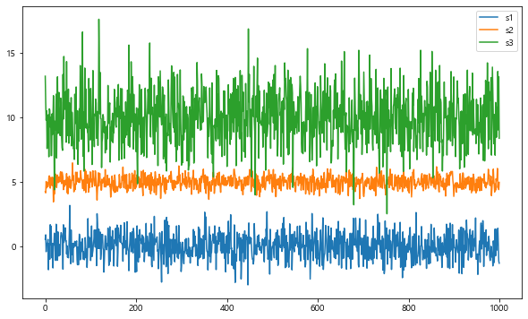

## Matplotlib :


- 시각화 패키지

- 파이썬 표준 시각화 도구로 불림

- 2D 평면 그래프에 관한 다양한 포맷과 기능 지원

- 데이터 분석 결과를 시각화 하는데 필요한 다양한 기능을 제공

  

#### 패키지 사용 법
1. matplotlib 주 패키지 사용

    - import matplotlib as mpl
    
2. pylab 서브 패키지 사용 : 주로 사용 한다.

    - import matplotlib.pyplot as plt

- 매직 명령어 %matplotlib inline 
    - 주피터 노트북 사용시 노트북 내부에 그림을 표시하는 명령어 (output으로 출력)
    
- 지원 되는 플롯 유형


    - 라인플롯(line plot) : plot()
    - 바 차트(bar chart) : bar()
    - 스캐터플롯(scatter plot) : scatter() 
    - 히스토그램(histogram) : hist()
    - 박스플롯(box plot) : boxplot()
    - 파이 차트(pie chart) : pie()
    - 기타 다양한 유형의 차트/플롯을 지원 : 관련 홈페이지를 참고


#### 그래프 용어 정리


```python
# matplotlib 패키지 등록
import matplotlib.pyplot as plt
%matplotlib inline

# 그래프는 show() 함수를 통해서 독립창에서 실행되는 것이 원칙
# 그래프를 콘솔에서 바로 작동되도록 하는 설정
```


```python
import numpy as np
import pandas as pd
```


```python
from IPython.core.interactiveshell import InteractiveShell
InteractiveShell.ast_node_interactivity = "all"
```


```python
# 한글 문제
# matplotlit의 기본 폰트에서 한글 지원되지 않기 때문에
# matplotlib의 폰트 변경 필요
import platform

from matplotlib import font_manager, rc
plt.rcParams['axes.unicode_minus'] = False

if platform.system() == 'Darwin':  # 맥OS 
    rc('font', family='AppleGothic')
elif platform.system() == 'Windows':  # 윈도우
    path = "c:/Windows/Fonts/malgun.ttf"
    font_name = font_manager.FontProperties(fname=path).get_name()
    rc('font', family=font_name)
else:
    print('Unknown system...  sorry~~~')
```


### 1. 라인 플롯 : plot() 함수 이용

#### 함수설명 : plot()


    - 기본으로 선을 그리는 함수
    - 데이터가 시간, 순서 등에 따라 변화를 보여주기 위해 사용


​    
- show()
    - 각화명령(그래프 그리는 함수) 후 실제로 차트로 렌더링 하고 마우스 이벤트등의 지시를 기다리는 함수
    - 주피터 노트북 에서는 셀 단위로 플롯 명령을 자동으로 렌더링  주므로 show 명령이 필요 없지만
    - 일반 파이썬 인터프리터(파이참)로 가동되는 경우를 대비해서 항상 마지막에 실행하도록 한다
    .


- 관련 함수 및 속성    
    - figure(x,y) : 그래프 크기 설정 : _단위 인치_
    - title() : 제목 출력
    - xlim : x 축 범위
    - ylim : y 축 범위
    - xticks():yticks() : 축과 값을 잇는 실선    
    - legend() : 범례
    - xlabel() : x축라벨(값)
    - ylabel() : y축라벨(값)
    - grid() : 그래프 배경으로 grid 사용 결정 함수
    
- line plot 에서 자주 사용되는 스타일 속성(약자로도 표기 가능)
   *  color:c(선색깔)
   *  linewidth : lw(선 굵기)
   *  linestyle: ls(선스타일)
   *  marker:마커 종류
   *  markersize : ms(마커크기)
   *  markeredgecolor:mec(마커선색깔)
   *  markeredgewidth:mew(마커선굵기)
   *  markerfacecolor:mfc(마커내부색깔)


```python
# plt.plot([]) 기본 문법 : [] 에 y 데이터값, x 데이터값은 y에 따라 자동 생성
plt.plot([1, 4, 9, 16]) # 그래프 렌더링(그릴 준비)자동으로 진행 - x 데이터값 [0, 1, 2, 3]은 자동 생성
plt.show() # 파이참에서는 독립창이 켜져 실행된다 (필수!)
```


    [<matplotlib.lines.Line2D at 0x1b6b1ad00a0>]


​    

​    


```python
# 그래프 크기설정 및 선 색상설정
#색상은 단어로 지정 : color='green'

t=[0,1,2,3,4,5,6]
y=[1,4,5,8,9,5,3]

plt.figure(figsize=(10,6)) # figsize = (가로, 세로) (단위는 인치)
plt.plot(t,y,color='green')
plt.show()
```


    <Figure size 720x432 with 0 Axes>


    [<matplotlib.lines.Line2D at 0x1b6b2243fa0>]


​    

​    


- linestyle =


- marker = 


- 라인스타일 기호 지정


```python
# 선 스타일 설정
#색상은 단어로 지정 : color='green'
t=[0,1,2,3,4,5,6]
y=[1,4,5,8,9,5,3]
plt.figure(figsize=(10,6))
# plt.plot(t,y,color='green',linestyle='dashdot')
plt.plot(t,y,color='green',linestyle='dotted')
plt.show()
```


    <Figure size 720x432 with 0 Axes>


    [<matplotlib.lines.Line2D at 0x1b6b23fa1f0>]


​    

​    


```python
# 선 스타일 설정
#색상은 단어로 지정 : color='green'
# 마커 추가
t=[0,1,2,3,4,5,6]
y=[1,4,5,8,9,5,3]
plt.figure(figsize=(10,6))
# plt.plot(t,y,color='green',linestyle='dashdot')
plt.plot(t,y,color='green',linestyle='dotted', marker='o')
plt.show()
```


    <Figure size 720x432 with 0 Axes>


    [<matplotlib.lines.Line2D at 0x1b6b22cfa60>]


​    

​    


```python
# marker facecolor : 마커 색상, makersize : 마커 크기
t=[0,1,2,3,4,5,6]
y=[1,4,5,8,9,5,3]
plt.figure(figsize=(10,6))
# plt.plot(t,y,color='green',linestyle='dashdot')
plt.plot(t,y,color='green',linestyle='dotted', marker='o',
        markerfacecolor = 'blue', markersize = 12)
plt.show()
```


    <Figure size 720x432 with 0 Axes>


    [<matplotlib.lines.Line2D at 0x1b6b2334970>]


​    

​    


```python
# 스타일 약자로 표시
# mew = marker edge width(마커 테두리 선의 넓이)
# lw = line width 선의 넓이
# ms = marker size
# mc = marker color
# mfc = marker face color
# mec = marker edge color

plt.figure(figsize=(10,6))

plt.plot([10,20,30,40,50],[1,4,9,16,25],
         c='b', lw=5, ls='--', marker='o', ms=15, mfc='r', mew=5, mec='g')

plt.title('스타일적용 예시')
plt.show()  
```


    <Figure size 720x432 with 0 Axes>


    [<matplotlib.lines.Line2D at 0x1b6b2630100>]


    Text(0.5, 1.0, '스타일적용 예시')


​    

​    


- color(c) : 선색깔
- linewidth(lw) : 선굵기
- linestyle(ls) : 선스타일


- marker : 마커의 종류
- markersize(ms) : 마커의 크기
- markeredgecolor(mec) : 마커 선 색깔
- markeredgewidth(mew) : 마커 선 굵기
- markerfacecolor(mfc) : 마커 내부 색깔


### 그래프 표현 범위 설정

- plt.xlim(시작값, 끝값) : x축의 범위 설정
- plt.ylim(시작값, 끝값) : y축의 범위 설정


```python
# 그래프 축 범위 설정

plt.figure(figsize=(10,6))

plt.plot([10,20,30,40,50],[1,4,9,16,25],
         c='b', lw=5, ls='--', marker='o', ms=15, mfc='r', mew=5, mec='g')

# plt.xlim(0,80) # x축의 범위
# plt.ylim(-10,80) # y축의 범위

# figsize는 동일해도 범위가 넓어지면 그래프가 좁아진다

plt.xlim(20,40)
plt.ylim(4,20)

plt.title('스타일적용 예시')
plt.show()  
```


    <Figure size 720x432 with 0 Axes>


    [<matplotlib.lines.Line2D at 0x1b6b3918820>]


    (20.0, 40.0)


    (4.0, 20.0)


    Text(0.5, 1.0, '스타일적용 예시')


​    

​    


- 
- 여러 개의 데이터를 하나의 그래프에 여러 선으로 표현
    - plot() 여러번 사용 가능


```python
t=np.arange(0.,5.,0.2)
t
```


    array([0. , 0.2, 0.4, 0.6, 0.8, 1. , 1.2, 1.4, 1.6, 1.8, 2. , 2.2, 2.4,
           2.6, 2.8, 3. , 3.2, 3.4, 3.6, 3.8, 4. , 4.2, 4.4, 4.6, 4.8])


```python
plt.figure(figsize=(10,6))
plt.title('하나의 그래프에서 여러 개의 선 그리기')

plt.plot(t,t, 'r--') # r(red), --(dashed line style)
plt.plot(t,0.5*t**2,'bs:') #b(blue),s(square marker,),:(dot line style)
plt.plot(t,0.5*t**3,'g^-') #g(green),^(triangle_up marker),-(solid lin style)
```


    <Figure size 720x432 with 0 Axes>


    Text(0.5, 1.0, '하나의 그래프에서 여러 개의 선 그리기')


    [<matplotlib.lines.Line2D at 0x1b6b38ad4f0>]


    [<matplotlib.lines.Line2D at 0x1b6b38a0430>]


    [<matplotlib.lines.Line2D at 0x1b6b2773f40>]


​    

​    


- 위 그래프 코드를 plot() 하나로 한 번에 표현하기


```python
plt.plot(t,t,'r--',t,0.5*t**2,'bs:',t,0.2*t**3,'g^-')
```


    [<matplotlib.lines.Line2D at 0x1b6b39fe970>,
     <matplotlib.lines.Line2D at 0x1b6b39fe820>,
     <matplotlib.lines.Line2D at 0x1b6b39fe9a0>]


​    

​    


#### tick 설정

- tick은 축상의 위치 표시 지점-축에 간격을 구분하기 위해 표시하는 눈금

- xticks([x축값1,x축값2,...]) #튜플,리스트등 이용해서 축 값(위치 나열)
- yticks([y축값1,y축값2,...]) #튜플,리스트등 이용해서 축 값(위치 나열)
- tick label(눈금 레이블) : tick에 써진 숫자 혹은 글자


```python
x=[10,20,30,40,50,60]
y=[11,15,40,40,20,10]
plt.plot(x,y, color='green',linestyle='dashed',marker='o')
plt.xticks(x)
plt.yticks(y)
plt.show()

# 40이 진한 이유는 두 번 만들어서
```


    [<matplotlib.lines.Line2D at 0x1b6b3a59b50>]


    ([<matplotlib.axis.XTick at 0x1b6b3a3d790>,
      <matplotlib.axis.XTick at 0x1b6b3a3d760>,
      <matplotlib.axis.XTick at 0x1b6b3a3b310>,
      <matplotlib.axis.XTick at 0x1b6b3a6a3d0>,
      <matplotlib.axis.XTick at 0x1b6b3a6a8e0>,
      <matplotlib.axis.XTick at 0x1b6b3a6adf0>],
     [Text(0, 0, ''),
      Text(0, 0, ''),
      Text(0, 0, ''),
      Text(0, 0, ''),
      Text(0, 0, ''),
      Text(0, 0, '')])


    ([<matplotlib.axis.YTick at 0x1b6b3a410a0>,
      <matplotlib.axis.YTick at 0x1b6b3a3dc40>,
      <matplotlib.axis.YTick at 0x1b6b3a3ba90>,
      <matplotlib.axis.YTick at 0x1b6b3a6f730>,
      <matplotlib.axis.YTick at 0x1b6b3a6fe80>,
      <matplotlib.axis.YTick at 0x1b6b3a6f040>],
     [Text(0, 0, ''),
      Text(0, 0, ''),
      Text(0, 0, ''),
      Text(0, 0, ''),
      Text(0, 0, ''),
      Text(0, 0, '')])


​    

​    


#### 눈금레이블 지정
- plt.xticks(틱값집합, 틱 레이블의 집합)
- plt.yticks(틱값집합, 틱 레이블의 집합)


```python
# 눈금 레이블 지정
# plt.xticks(틱값집합, 틱 레이블의 집합)

x=[10,20,30,40,50,60]
y=[11,15,40,40,20,10]
plt.plot(x,y, color='green',linestyle='dashed',marker='o')
plt.xticks(x, ['10대', '20대', '30대', '40대', '50대', '60대'])
plt.yticks(y, [y[i] for i in range(6)]) # y리스트값 한 번씩 추출해 리스트에 추가하는 내포 for문
plt.show()
```


    [<matplotlib.lines.Line2D at 0x1b6b3ab1b50>]


    ([<matplotlib.axis.XTick at 0x1b6b3a94730>,
      <matplotlib.axis.XTick at 0x1b6b3a94700>,
      <matplotlib.axis.XTick at 0x1b6b3a902e0>,
      <matplotlib.axis.XTick at 0x1b6b3ac33d0>,
      <matplotlib.axis.XTick at 0x1b6b3ac3820>,
      <matplotlib.axis.XTick at 0x1b6b3ac3d30>],
     [Text(10, 0, '10대'),
      Text(20, 0, '20대'),
      Text(30, 0, '30대'),
      Text(40, 0, '40대'),
      Text(50, 0, '50대'),
      Text(60, 0, '60대')])


    ([<matplotlib.axis.YTick at 0x1b6b3a94fa0>,
      <matplotlib.axis.YTick at 0x1b6b3a94bb0>,
      <matplotlib.axis.YTick at 0x1b6b3a90a60>,
      <matplotlib.axis.YTick at 0x1b6b3ac77f0>,
      <matplotlib.axis.YTick at 0x1b6b3ac7e20>,
      <matplotlib.axis.YTick at 0x1b6b3ac73d0>],
     [Text(0, 11, '11'),
      Text(0, 15, '15'),
      Text(0, 40, '40'),
      Text(0, 40, '40'),
      Text(0, 20, '20'),
      Text(0, 10, '10')])


​    

​    


```python
x=[10,20,30,40,50,60]
y=[11,15,40,40,20,10]
plt.plot(x,y, color='green',linestyle='dashed',marker='o')
plt.xticks(x, ['10대', '20대', '30대', '40대', '50대', '60대'])
plt.yticks([0, 10, 20, 30, 40, 50]) # y리스트값 한 번씩 추출해 리스트에 추가하는 내포 for문
plt.show()
```


    [<matplotlib.lines.Line2D at 0x1b6b4b6f400>]


    ([<matplotlib.axis.XTick at 0x1b6b3b75f70>,
      <matplotlib.axis.XTick at 0x1b6b3b75f40>,
      <matplotlib.axis.XTick at 0x1b6b3b74fd0>,
      <matplotlib.axis.XTick at 0x1b6b4b6fb80>,
      <matplotlib.axis.XTick at 0x1b6b4b750d0>,
      <matplotlib.axis.XTick at 0x1b6b4b755e0>],
     [Text(10, 0, '10대'),
      Text(20, 0, '20대'),
      Text(30, 0, '30대'),
      Text(40, 0, '40대'),
      Text(50, 0, '50대'),
      Text(60, 0, '60대')])


    ([<matplotlib.axis.YTick at 0x1b6b3b7d820>,
      <matplotlib.axis.YTick at 0x1b6b38e0730>,
      <matplotlib.axis.YTick at 0x1b6b3b75280>,
      <matplotlib.axis.YTick at 0x1b6b4b80160>,
      <matplotlib.axis.YTick at 0x1b6b4b80670>,
      <matplotlib.axis.YTick at 0x1b6b4b80b80>],
     [Text(0, 0, ''),
      Text(0, 0, ''),
      Text(0, 0, ''),
      Text(0, 0, ''),
      Text(0, 0, ''),
      Text(0, 0, '')])


​    

​    


```python
x=[10,20,30,40,50,60]
y=[11,15,40,40,20,10]
plt.plot(x,y, color='green',linestyle='dashed',marker='o')
# plt.xticks([1, 2, 3, 4, 5, 6],['10대', '20대', '30대', '40대', '50대', '60대'])
plt.xticks([10,20,30,40,50,60],['10대', '20대', '30대', '40대', '50대', '60대'])
plt.yticks([0, 10, 20, 30, 40, 50])
plt.show()
```


    [<matplotlib.lines.Line2D at 0x1b6b4c72a90>]


    ([<matplotlib.axis.XTick at 0x1b6b4c556a0>,
      <matplotlib.axis.XTick at 0x1b6b4c55670>,
      <matplotlib.axis.XTick at 0x1b6b4c4f250>,
      <matplotlib.axis.XTick at 0x1b6b4c802e0>,
      <matplotlib.axis.XTick at 0x1b6b4c807f0>,
      <matplotlib.axis.XTick at 0x1b6b4c80d00>],
     [Text(10, 0, '10대'),
      Text(20, 0, '20대'),
      Text(30, 0, '30대'),
      Text(40, 0, '40대'),
      Text(50, 0, '50대'),
      Text(60, 0, '60대')])


    ([<matplotlib.axis.YTick at 0x1b6b4c55f10>,
      <matplotlib.axis.YTick at 0x1b6b4c55af0>,
      <matplotlib.axis.YTick at 0x1b6b4c4f9a0>,
      <matplotlib.axis.YTick at 0x1b6b4c89790>,
      <matplotlib.axis.YTick at 0x1b6b4c89dc0>,
      <matplotlib.axis.YTick at 0x1b6b4c8d310>],
     [Text(0, 0, ''),
      Text(0, 0, ''),
      Text(0, 0, ''),
      Text(0, 0, ''),
      Text(0, 0, ''),
      Text(0, 0, '')])


​    

​    


- 그래프 제목 및 축 레이블 설정
    - plot.title(data,loc=, pad=, fontsize=)
        - loc= 'right'|'left'| 'center'| 'right'로 설정할 수 있으며 디폴트는 'center'
        - pad=point 은 타이틀과 그래프와의 간격 (오프셋)을 포인트(숫자) 단위로 설정
        - fontsize=제목폰트크기
        
    - plot.xlabel()
    - plot.ylabel()


```python
x=[10,20,30,40,50,60]
y=[11,15,40,40,20,10]
# plt.title('그래프제목')
# plt.title('그래프제목', loc='left', pad=-100)
# 아무리 패드를 작게 설정해도 그래프 안의 영역은 침범하지 못함

plt.title('그래프제목', loc='right', pad=0)
# plt.title('그래프제목', loc='right', pad=30)
# plt.title('그래프제목', loc='right', pad=30, fontsize=20)
plt.plot(x,y, color='green',linestyle='dashed',marker='o')
plt.xticks(x,('10대','20대','30대','40대','50대','60대'))
plt.yticks(y,(y[i] for i in range(6)))
plt.xlabel('x축제목')
plt.ylabel('y축제목')
plt.show()
```


    Text(1.0, 1.0, '그래프제목')


    [<matplotlib.lines.Line2D at 0x1b6b3b62130>]


    ([<matplotlib.axis.XTick at 0x1b6b3b6e0a0>,
      <matplotlib.axis.XTick at 0x1b6b3b6efa0>,
      <matplotlib.axis.XTick at 0x1b6b4ca1400>,
      <matplotlib.axis.XTick at 0x1b6b4c98700>,
      <matplotlib.axis.XTick at 0x1b6b4ca44c0>,
      <matplotlib.axis.XTick at 0x1b6b4caac10>],
     [Text(10, 0, '10대'),
      Text(20, 0, '20대'),
      Text(30, 0, '30대'),
      Text(40, 0, '40대'),
      Text(50, 0, '50대'),
      Text(60, 0, '60대')])


    ([<matplotlib.axis.YTick at 0x1b6b4c3e7f0>,
      <matplotlib.axis.YTick at 0x1b6b4d78940>,
      <matplotlib.axis.YTick at 0x1b6b3a76b20>,
      <matplotlib.axis.YTick at 0x1b6b4d95a90>,
      <matplotlib.axis.YTick at 0x1b6b4cee190>,
      <matplotlib.axis.YTick at 0x1b6b4ceee80>],
     [Text(0, 11, '11'),
      Text(0, 15, '15'),
      Text(0, 40, '40'),
      Text(0, 40, '40'),
      Text(0, 20, '20'),
      Text(0, 10, '10')])


    Text(0.5, 0, 'x축제목')


    Text(0, 0.5, 'y축제목')


​    

​    


```python
plt.title('그래프제목', loc='right', pad=20)

title_font = {
    'fontsize' : 16,
    'fontweight' : 'bold'
}

plt.title('그래프제목', fontdict=title_font, loc='left', pad=20)
```


    Text(1.0, 1.0, '그래프제목')


    Text(0.0, 1.0, '그래프제목')


​    

​    


#### 그래프 Title 폰트 관련 지정

- 딕셔너리형식으로 fontsize 및 fontwegith 등 지정 가능


```python
- plt.grid(True) : 그래프 배경에 격자 그림
    - 그래프의 전달력을 높인다
```


```python
x=[10,20,30,40,50,60]
y=[11,15,40,40,20,10]
plt.title('그래프제목')
plt.plot(x,y, color='green',linestyle='dashed',marker='o')
plt.xticks(x,('10대','20대','30대','40대','50대','60대'))
plt.yticks([0,10,20,30,40,50])
plt.xlabel('x축제목')
plt.ylabel('y축제목')
plt.grid(True)
plt.show()

```


    Text(0.5, 1.0, '그래프제목')


    [<matplotlib.lines.Line2D at 0x1b6b4f39430>]


    ([<matplotlib.axis.XTick at 0x1b6b4f14fa0>,
      <matplotlib.axis.XTick at 0x1b6b4f14f70>,
      <matplotlib.axis.XTick at 0x1b6b4f08b20>,
      <matplotlib.axis.XTick at 0x1b6b4f39b80>,
      <matplotlib.axis.XTick at 0x1b6b4f460d0>,
      <matplotlib.axis.XTick at 0x1b6b4f465e0>],
     [Text(10, 0, '10대'),
      Text(20, 0, '20대'),
      Text(30, 0, '30대'),
      Text(40, 0, '40대'),
      Text(50, 0, '50대'),
      Text(60, 0, '60대')])


    ([<matplotlib.axis.YTick at 0x1b6b4f16880>,
      <matplotlib.axis.YTick at 0x1b6b4f16460>,
      <matplotlib.axis.YTick at 0x1b6b4f142b0>,
      <matplotlib.axis.YTick at 0x1b6b4f46c70>,
      <matplotlib.axis.YTick at 0x1b6b4f46fa0>,
      <matplotlib.axis.YTick at 0x1b6b4f4d4f0>],
     [Text(0, 0, ''),
      Text(0, 0, ''),
      Text(0, 0, ''),
      Text(0, 0, ''),
      Text(0, 0, ''),
      Text(0, 0, '')])


    Text(0.5, 0, 'x축제목')


    Text(0, 0.5, 'y축제목')


​    

​    


 #### subplot() : 하나의 윈도우(figure)안에 여러 개의 플롯을 배열 형태로 표시

    - 그리드 형태의 Axes 객체들 생성

- 형식 : subplot(인수1,인수2,인수3) - 한 번 실행할 때마다 한 개의 Axes 객체를 생성
- 인수1 과 인수2는 전체 그리드 행렬 모양 지시
- 인수3 : 그래프 위치 번호


    - subplot(2,2,1) 가 원칙이나 줄여서 221로 쓸 수 있음
    - subplot(221) 2행 2열의 그리드에서 첫번째 위치
    - subplot(224) 2행 2열의 그리드에서 마지막 위치


​    
- tight_layout(pad=) : 플롯간 간격을 설정
    - pad = 간격값(실수)


```python
# 2 X 2 행렬의 AXes 객체 나열

np.random.seed(0) # 항상 같은 난수가 발생

plt.subplot(221) #그래프 show()-객체생성 하기 전에 먼저 위치를 설정
plt.plot(np.random.rand(5))
plt.title('axes1')

plt.subplot(222) #그래프 show()-객체생성 하기 전에 먼저 위치를 설정
plt.plot(np.random.rand(5))
plt.title('axes2')

plt.subplot(223) #그래프 show()-객체생성 하기 전에 먼저 위치를 설정
plt.plot(np.random.rand(5))
plt.title('axes3')

plt.subplot(224) #그래프 show()-객체생성 하기 전에 먼저 위치를 설정
plt.plot(np.random.rand(5))
plt.title('axes4')

plt.tight_layout(1.5) # 그래프 간의 간격을 설정하는 함수

plt.show()
```


    <AxesSubplot:>


    [<matplotlib.lines.Line2D at 0x1b6b52bacd0>]


    Text(0.5, 1.0, 'axes1')


    <AxesSubplot:>


    [<matplotlib.lines.Line2D at 0x1b6b5313490>]


    Text(0.5, 1.0, 'axes2')


    <AxesSubplot:>


    [<matplotlib.lines.Line2D at 0x1b6b5342be0>]


    Text(0.5, 1.0, 'axes3')


    <AxesSubplot:>


    [<matplotlib.lines.Line2D at 0x1b6b537d370>]


    Text(0.5, 1.0, 'axes4')

    <ipython-input-49-7fdc25691f27>:21: MatplotlibDeprecationWarning: Passing the pad parameter of tight_layout() positionally is deprecated since Matplotlib 3.3; the parameter will become keyword-only two minor releases later.
      plt.tight_layout(1.5)


    


- plt.subplots(행,열)

    - 여러개의 Axes 객체를 동시에 생성해주는 함수
    - 행렬 형태의 객체로 반환
    
    
   - 두 개의 반환값이 있음 : 
        - 첫 번째 반환은 그래프 객체 전체 이름 - 거의 사용하지 않음
        - 두 번째 반환값에 Axes 객체를 반환 함
        - 두 번째 반환값이 필요하므로 반환 값 모두를 반환받아 두 번째 값을 사용해야 함
        
        - ex. fig, axes = plt.subplots(2,2)


```python
fig, axes = plt.subplots(2,2)

np.random.seed(0)

axes[0,0].plot(np.random.rand(5))# axes 객체 내에 함수를 그리는 것
axes[0,0].set_title('axes1')

axes[0,1].plot(np.random.rand(5))
axes[0,1].set_title('axes2')

axes[1,0].plot(np.random.rand(5))
axes[1,0].set_title('axes3')

axes[1,1].plot(np.random.rand(5))
axes[1,1].set_title('axes4')

plt.tight_layout(1,5)
plt.show()
```


    [<matplotlib.lines.Line2D at 0x1b6b66a0430>]


    Text(0.5, 1.0, 'axes1')


    [<matplotlib.lines.Line2D at 0x1b6b66a0850>]


    Text(0.5, 1.0, 'axes2')


    [<matplotlib.lines.Line2D at 0x1b6b66a0bb0>]


    Text(0.5, 1.0, 'axes3')


    [<matplotlib.lines.Line2D at 0x1b6b66a0f40>]


    Text(0.5, 1.0, 'axes4')

    <ipython-input-52-89c9e31e3110>:17: MatplotlibDeprecationWarning: Passing the pad parameter of tight_layout() positionally is deprecated since Matplotlib 3.3; the parameter will become keyword-only two minor releases later.
      plt.tight_layout(1,5)


    


#### 범례(Legend)표시

- plot에 label 속성이 추가되어 있어야 함
    - plt.plot(x, y, label = 'a')
- plt.legend(loc = , ncol = ) # 범례 표시
- loc = 1/2/3/4/5/6/7/8/9/10 # 범례 표시 위치값
- loc = (x, y)
- ncol = 열의 개수


```python
plt.plot([1, 2, 3, 4], [2, 3, 5, 10], label='Price ($)')
plt.xlabel('X-Axis')
plt.ylabel('Y-Axis')
# plt.legend(loc=(0.0, 0.0))
# plt.legend(loc=(1.0, 1.0))
# plt.legend(loc=(0.5, 0.5))  # 그래프 가운데 왼쪽 하단의 꼭짓점에 맞춰짐
# plt.legend(loc=10)
plt.legend(loc='center left')
```


    [<matplotlib.lines.Line2D at 0x1b6b7ab5700>]


    Text(0.5, 0, 'X-Axis')


    Text(0, 0.5, 'Y-Axis')


    <matplotlib.legend.Legend at 0x1b6b79d7940>


​    

​    


```python
import matplotlib.pyplot as plt

plt.plot([1, 2, 3, 4], [2, 3, 5, 10], label='Price ($)')
plt.plot([1, 2, 3, 4], [3, 5, 9, 7], label='Demand (#)')

# 하나의 영역에 두 개의 그래프 그림
# 따라서 범례(label)도 두 개가 필요

plt.xlabel('X-Axis')
plt.ylabel('Y-Axis')
plt.legend(loc='best') #열 1개
# plt.legend(loc='best', ncol=2) # 열 2개


plt.show()
```


    [<matplotlib.lines.Line2D at 0x1b6b7b9f520>]


    [<matplotlib.lines.Line2D at 0x1b6b7b9f940>]


    Text(0.5, 0, 'X-Axis')


    Text(0, 0.5, 'Y-Axis')


    <matplotlib.legend.Legend at 0x1b6b7b9f7f0>


​    

​    


#### 막대 그래프

- 세로 막대 그래프 그리기 : bar()
    - bar(x, y, color = [], alpha = )
    - color = [] : 색상값 설정
    - alpha =  : 투명도 설정 (0: 투명 ~ 1: 불투명)


```python
# 예제 data
y=[2,3,1,4]
x=np.arange(len(y))
z=[2,3]
s=[0,1]

e=[1,4]
h=[2,3]
xlabel = ['가', '나', '다', '라']
```


```python
array([0, 1, 2, 3])
```


```python
# 그래프 그리기
plt.figure(figsize=(10,6)) # 720x432 픽셀의 크기
plt.title('Bar chart') # 그래프 제목 설정
plt.bar(x,y)
```


    <Figure size 720x432 with 0 Axes>


    Text(0.5, 1.0, 'Bar chart')


    <BarContainer object of 4 artists>


​    

​    


```python
# 그래프 그리기
plt.figure(figsize=(10,6)) # 720x432 픽셀의 크기
plt.title('Bar chart') # 그래프 제목 설정
plt.bar(x,y)
plt.xticks(x,xlabel)
plt.yticks(sorted(y))

# 그래프에 텍스트를 출력하기 : plt.text(x위치, y위치, 출력할 문자열)
plt.text(-0.1, 1, 'test')
plt.text(-0.1, 1, r'test') # row-format 형태로 출력해라

# r'문자열' : 문자열을 렌더링할 때 row-format으로 그림
# rowformat : 해당 장치에서 가장 표준화된 형태로 표현

plt.xlabel('가나다라') # x축 제목
plt.ylabel('빈도수') # y축 제목

plt.show()
```


    <Figure size 720x432 with 0 Axes>


    Text(0.5, 1.0, 'Bar chart')


    <BarContainer object of 4 artists>


    ([<matplotlib.axis.XTick at 0x1b6b7d2af10>,
      <matplotlib.axis.XTick at 0x1b6b7d2af40>,
      <matplotlib.axis.XTick at 0x1b6b8090910>,
      <matplotlib.axis.XTick at 0x1b6b7625d30>],
     [Text(0, 0, '가'), Text(1, 0, '나'), Text(2, 0, '다'), Text(3, 0, '라')])


    ([<matplotlib.axis.YTick at 0x1b6b7c939a0>,
      <matplotlib.axis.YTick at 0x1b6b7c939d0>,
      <matplotlib.axis.YTick at 0x1b6b838cc40>,
      <matplotlib.axis.YTick at 0x1b6b763e5e0>],
     [Text(0, 0, ''), Text(0, 0, ''), Text(0, 0, ''), Text(0, 0, '')])


    Text(-0.1, 1, 'test')


    Text(-0.1, 1, 'test')


    Text(0.5, 0, '가나다라')


    Text(0, 0.5, '빈도수')


​    

​    


```python
# 그래프 그리기 - 선 그래프와 막대 그래프를 동시에 표현

plt.figure(figsize=(10,6)) # 720x432 픽셀의 크기
plt.title('Bar chart') # 그래프 제목 설정
plt.bar(x,y)

# 라인 그래프 추가하기
plt.plot(s,z, color='g', linestyle='--', marker='o')
plt.plot(h,e, color='g', linestyle='--', marker='o')

plt.xticks(x,xlabel)
plt.yticks(sorted(y))

# 그래프에 텍스트를 출력하기 : plt.text(x위치, y위치, 출력할 문자열)
plt.text(-0.1, 1, 'test')
plt.text(-0.1, 1, r'test') # row-format 형태로 출력해라

# r'문자열' : 문자열을 렌더링할 때 row-format으로 그림
# rowformat : 해당 장치에서 가장 표준화된 형태로 표현

plt.xlabel('가나다라') # x축 제목
plt.ylabel('빈도수') # y축 제목


plt.show()
```


    <Figure size 720x432 with 0 Axes>


    Text(0.5, 1.0, 'Bar chart')


    <BarContainer object of 4 artists>


    [<matplotlib.lines.Line2D at 0x1b6b83bd670>]


    [<matplotlib.lines.Line2D at 0x1b6b83c95e0>]


    ([<matplotlib.axis.XTick at 0x1b6b75e6310>,
      <matplotlib.axis.XTick at 0x1b6b75e62e0>,
      <matplotlib.axis.XTick at 0x1b6b75e3e20>,
      <matplotlib.axis.XTick at 0x1b6b83c9df0>],
     [Text(0, 0, '가'), Text(1, 0, '나'), Text(2, 0, '다'), Text(3, 0, '라')])


    ([<matplotlib.axis.YTick at 0x1b6b75e68e0>,
      <matplotlib.axis.YTick at 0x1b6b75e6790>,
      <matplotlib.axis.YTick at 0x1b6b75e15b0>,
      <matplotlib.axis.YTick at 0x1b6b83ce700>],
     [Text(0, 0, ''), Text(0, 0, ''), Text(0, 0, ''), Text(0, 0, '')])


    Text(-0.1, 1, 'test')


    Text(-0.1, 1, 'test')


    Text(0.5, 0, '가나다라')


    Text(0, 0.5, '빈도수')


​    

​    


* 가로 막대 그래프 그리기
    * barh(y, x, color=[], alpha=)


```python
np.random.seed(0)
people=['몽룡','춘향','방자','향단']
y=np.arange(len(people))
performance = 3+ 10 * np.random.rand(len(people))
```


```python
y
performance # x의 값
```


    array([0, 1, 2, 3])


    array([ 8.48813504, 10.15189366,  9.02763376,  8.44883183])


```python
# 가로 막대 그래프 그리기
plt.title('Barh Chart')
plt.barh(y,performance,alpha=0.4)
plt.grid(True)

```


    Text(0.5, 1.0, 'Barh Chart')


    <BarContainer object of 4 artists>


​    

​    


```python
y
people
```


    array([0, 1, 2, 3])


    ['몽룡', '춘향', '방자', '향단']


```python
# 가로 막대 그래프 그리기 - 옵션함수 이용하여 그래프 꾸미기
plt.title('Barh Chart')
plt.barh(y,performance,alpha=0.8) # alpha값이 1에 가까울수록 불투명
plt.yticks(y, people)

plt.xlabel('방문 횟수')
plt.ylabel('회원')

plt.show()
```


    Text(0.5, 1.0, 'Barh Chart')


    <BarContainer object of 4 artists>


    ([<matplotlib.axis.YTick at 0x1b6b84f5e50>,
      <matplotlib.axis.YTick at 0x1b6b84f5a60>,
      <matplotlib.axis.YTick at 0x1b6b84f28b0>,
      <matplotlib.axis.YTick at 0x1b6b8513970>],
     [Text(0, 0, '몽룡'), Text(0, 1, '춘향'), Text(0, 2, '방자'), Text(0, 3, '향단')])


    Text(0.5, 0, '방문 횟수')


    Text(0, 0.5, '회원')


​    

​    


```python
#데이터 프레임으로 바 그래프 그리기 1
# 예제 df 생성
df0 = pd.DataFrame({
    '나이':[15,20,17,50,2,30,23],
    '이름':['둘리','도우너','또치','길동','희동','마이클','영희']
},columns=['나이','이름'])
df0

x = [0, 1, 2, 3, 4, 5, 6] # xticks 위치 표시에 사용할 변수

```


<div>
<style scoped>
    .dataframe tbody tr th:only-of-type {
        vertical-align: middle;
    }
</style>
<table border="1" class="dataframe">
  <thead>
    <tr style="text-align: right;">
      <th></th>
      <th>나이</th>
      <th>이름</th>
    </tr>
  </thead>
  <tbody>
    <tr>
      <th>0</th>
      <td>15</td>
      <td>둘리</td>
    </tr>
    <tr>
      <th>1</th>
      <td>20</td>
      <td>도우너</td>
    </tr>
    <tr>
      <th>2</th>
      <td>17</td>
      <td>또치</td>
    </tr>
    <tr>
      <th>3</th>
      <td>50</td>
      <td>길동</td>
    </tr>
    <tr>
      <th>4</th>
      <td>2</td>
      <td>희동</td>
    </tr>
    <tr>
      <th>5</th>
      <td>30</td>
      <td>마이클</td>
    </tr>
    <tr>
      <th>6</th>
      <td>23</td>
      <td>영희</td>
    </tr>
  </tbody>
</table>
</div>


```python
#데이터 프레임으로 바 그래프 그리기 1
# df.plot(kind='bar', grid=T/F, figsize='그래프 크기')

df0.plot(kind='bar',grid=True,figsize=(10,10))
plt.plot(df0.나이,'ro--') # 데이터프레임에서 생성한 그래프 영역을 공유해서 사용

df0.plot(kind='line') # 데이터프레임에 plot() 함수를 사용할 때마다 독립적인 그래프 영역을 그리게 됨

# 그래프를 그릴 수 있는 열 자체가 '나이' 열밖에 없기 때문에 이를 이용해서 그래프 그렸음

plt.xticks(x,df0.이름, rotation='horizontal') # 이름 열의 값을 라벨로 써주셈
# rotiation = vertical/horizontal 중 하나 가능 = 라벨의 출력 방향 결정 
# (생략하면 vertical 방향으로 만들어짐)

plt.show()
```


    <AxesSubplot:>


    [<matplotlib.lines.Line2D at 0x1b6baa18760>]


    <AxesSubplot:>


    ([<matplotlib.axis.XTick at 0x1b6baa290d0>,
      <matplotlib.axis.XTick at 0x1b6baa290a0>,
      <matplotlib.axis.XTick at 0x1b6baa4c430>,
      <matplotlib.axis.XTick at 0x1b6baa574f0>,
      <matplotlib.axis.XTick at 0x1b6baa57a00>,
      <matplotlib.axis.XTick at 0x1b6baa57f10>,
      <matplotlib.axis.XTick at 0x1b6baa60460>],
     [Text(0, 0, '둘리'),
      Text(1, 0, '도우너'),
      Text(2, 0, '또치'),
      Text(3, 0, '길동'),
      Text(4, 0, '희동'),
      Text(5, 0, '마이클'),
      Text(6, 0, '영희')])


​    

​    


    


```python
# 예제 df 생성
# 그래프로 그릴 수 있는 열이 두 개일 때
df1 = pd.DataFrame({
    '나이':[15,20,17,50,2,30,23],
    '키' : [165,150,151,175,80,175,185],
    '이름':['둘리','도우너','또치','길동','희동','마이클','영희']
},columns=['나이','키','이름'])
df1
```


<div>
<style scoped>
    .dataframe tbody tr th:only-of-type {
        vertical-align: middle;
    }
</style>
<table border="1" class="dataframe">
  <thead>
    <tr style="text-align: right;">
      <th></th>
      <th>나이</th>
      <th>키</th>
      <th>이름</th>
    </tr>
  </thead>
  <tbody>
    <tr>
      <th>0</th>
      <td>15</td>
      <td>165</td>
      <td>둘리</td>
    </tr>
    <tr>
      <th>1</th>
      <td>20</td>
      <td>150</td>
      <td>도우너</td>
    </tr>
    <tr>
      <th>2</th>
      <td>17</td>
      <td>151</td>
      <td>또치</td>
    </tr>
    <tr>
      <th>3</th>
      <td>50</td>
      <td>175</td>
      <td>길동</td>
    </tr>
    <tr>
      <th>4</th>
      <td>2</td>
      <td>80</td>
      <td>희동</td>
    </tr>
    <tr>
      <th>5</th>
      <td>30</td>
      <td>175</td>
      <td>마이클</td>
    </tr>
    <tr>
      <th>6</th>
      <td>23</td>
      <td>185</td>
      <td>영희</td>
    </tr>
  </tbody>
</table>
</div>


```python
df1.plot(kind='bar',grid=True,figsize=(10,10)) # 데이터프레임의 그래프 그리는 함수를 사용한 것임
# 컬럼명이 자동으로 범례로 설정
plt.plot(df1.나이,'ro--') # 선 그래프 생성(plt 객체의 plot()함수)
plt.plot(df1.키,'b^--')


plt.xticks(x,df1.이름, rotation='horizontal')

plt.xlabel('회원')
plt.ylabel('검사결과')

plt.title('신체검사')
```


    <AxesSubplot:>


    [<matplotlib.lines.Line2D at 0x1b6ba990130>]


    [<matplotlib.lines.Line2D at 0x1b6b9faf070>]


    ([<matplotlib.axis.XTick at 0x1b6b8429850>,
      <matplotlib.axis.XTick at 0x1b6b8429730>,
      <matplotlib.axis.XTick at 0x1b6b9622f70>,
      <matplotlib.axis.XTick at 0x1b6baa87790>,
      <matplotlib.axis.XTick at 0x1b6baa95d00>,
      <matplotlib.axis.XTick at 0x1b6b9f599a0>,
      <matplotlib.axis.XTick at 0x1b6ba9908e0>],
     [Text(0, 0, '둘리'),
      Text(1, 0, '도우너'),
      Text(2, 0, '또치'),
      Text(3, 0, '길동'),
      Text(4, 0, '희동'),
      Text(5, 0, '마이클'),
      Text(6, 0, '영희')])


    Text(0.5, 0, '회원')


    Text(0, 0.5, '검사결과')


    Text(0.5, 1.0, '신체검사')


​    

​    


```python
df1
```


<div>
<style scoped>
    .dataframe tbody tr th:only-of-type {
        vertical-align: middle;
    }
</style>
<table border="1" class="dataframe">
  <thead>
    <tr style="text-align: right;">
      <th></th>
      <th>나이</th>
      <th>키</th>
      <th>이름</th>
    </tr>
  </thead>
  <tbody>
    <tr>
      <th>0</th>
      <td>15</td>
      <td>165</td>
      <td>둘리</td>
    </tr>
    <tr>
      <th>1</th>
      <td>20</td>
      <td>150</td>
      <td>도우너</td>
    </tr>
    <tr>
      <th>2</th>
      <td>17</td>
      <td>151</td>
      <td>또치</td>
    </tr>
    <tr>
      <th>3</th>
      <td>50</td>
      <td>175</td>
      <td>길동</td>
    </tr>
    <tr>
      <th>4</th>
      <td>2</td>
      <td>80</td>
      <td>희동</td>
    </tr>
    <tr>
      <th>5</th>
      <td>30</td>
      <td>175</td>
      <td>마이클</td>
    </tr>
    <tr>
      <th>6</th>
      <td>23</td>
      <td>185</td>
      <td>영희</td>
    </tr>
  </tbody>
</table>
</div>


```python
# 데이터프레임으로 바 그래프 그리기 1-2
# 컬럼을 지정해서 그래프 그리기 : 반드시 plt 객체만 사용

plt.bar(df1.이름, df1.나이) 
# x축 : 이름, y축: 나이
plt.show()
```


    <BarContainer object of 7 artists>


​    

​    


```python
# 데이터프레임으로 바 그래프 그리기 1-3
# 컬럼을 지정해서 그래프 그리기 : 반드시 plt 객체만 사용

# df1.plot() : 데이터가 df 형태면 plot() 함수 사용 가능

df1[['나이']] # 시리즈를 데이터프레임으로 변환했기 때문에 plot() 함수 사용 가능함
df1[['나이']].sort_values(by='나이').plot(kind='bar')
```


<div>
<style scoped>
    .dataframe tbody tr th:only-of-type {
        vertical-align: middle;
    }
</style>
<table border="1" class="dataframe">
  <thead>
    <tr style="text-align: right;">
      <th></th>
      <th>나이</th>
    </tr>
  </thead>
  <tbody>
    <tr>
      <th>0</th>
      <td>15</td>
    </tr>
    <tr>
      <th>1</th>
      <td>20</td>
    </tr>
    <tr>
      <th>2</th>
      <td>17</td>
    </tr>
    <tr>
      <th>3</th>
      <td>50</td>
    </tr>
    <tr>
      <th>4</th>
      <td>2</td>
    </tr>
    <tr>
      <th>5</th>
      <td>30</td>
    </tr>
    <tr>
      <th>6</th>
      <td>23</td>
    </tr>
  </tbody>
</table>
</div>


    <AxesSubplot:>


​    

​    


### 데이터프레임을 이용해서 가로 막대 그래프 그리기

- df.plot(kind='barh')


```python
df0
```


<div>
<style scoped>
    .dataframe tbody tr th:only-of-type {
        vertical-align: middle;
    }
</style>
<table border="1" class="dataframe">
  <thead>
    <tr style="text-align: right;">
      <th></th>
      <th>나이</th>
      <th>이름</th>
    </tr>
  </thead>
  <tbody>
    <tr>
      <th>0</th>
      <td>15</td>
      <td>둘리</td>
    </tr>
    <tr>
      <th>1</th>
      <td>20</td>
      <td>도우너</td>
    </tr>
    <tr>
      <th>2</th>
      <td>17</td>
      <td>또치</td>
    </tr>
    <tr>
      <th>3</th>
      <td>50</td>
      <td>길동</td>
    </tr>
    <tr>
      <th>4</th>
      <td>2</td>
      <td>희동</td>
    </tr>
    <tr>
      <th>5</th>
      <td>30</td>
      <td>마이클</td>
    </tr>
    <tr>
      <th>6</th>
      <td>23</td>
      <td>영희</td>
    </tr>
  </tbody>
</table>
</div>


```python
# 데이터 정렬 후 가로막대 그래프 그리기

df2 = df0.sort_values(by='나이')
df2.plot(kind='barh')

# df0.plot(kind='barh')
plt.yticks([0,1,2,3,4,5,6], df2.이름)
# 이름 = 라벨
```


    <AxesSubplot:>


    ([<matplotlib.axis.YTick at 0x1b6bc20db80>,
      <matplotlib.axis.YTick at 0x1b6bc20d760>,
      <matplotlib.axis.YTick at 0x1b6bc2327f0>,
      <matplotlib.axis.YTick at 0x1b6bc24d580>,
      <matplotlib.axis.YTick at 0x1b6bc24da90>,
      <matplotlib.axis.YTick at 0x1b6bc24dfa0>,
      <matplotlib.axis.YTick at 0x1b6bc2524f0>],
     [Text(0, 0, '희동'),
      Text(0, 1, '둘리'),
      Text(0, 2, '또치'),
      Text(0, 3, '도우너'),
      Text(0, 4, '영희'),
      Text(0, 5, '마이클'),
      Text(0, 6, '길동')])


​    

​    


### 스캐터 플롯(Scatter plot) : scatter() 함수를 이용하여 그릴 수 있음

    * 분산형 그래프 : 데이터의 위치를 표현


```python
# 예제 data
t = np.array([0, 1, 2, 3, 4, 5, 6, 7, 8, 9])
y = np.array([9,8,7,9,8,3,2,4,3,4])

```


```python
plt.figure(figsize=(10,6))
plt.scatter(t,y, marker='>') # 마커 지정이 가능함
plt.show()
```


    <Figure size 720x432 with 0 Axes>


    <matplotlib.collections.PathCollection at 0x1b6bc3f9880>


​    

​    


#### 버블차트

- scatter 그래프의 응용
- 데이터의 값을 크기나 색상 값으로 활용해서 서로 다른 마커 색상과 크기를 표시하는 그래프
- plt.scatter(x값, y값, c = 데이터 값, s = 데이터 값 ) # 마커 지정


```python
N=30
np.random.seed(0)
x=np.random.rand(N)
y1 =np.random.rand(N)
y2 =np.random.rand(N)
y3=np.pi *(15 * np.random.rand(N))**2
```


```python
x
y1
y2
y3 # 큰 값일뿐 아니라 간격도 넓은 데이터임
```


    array([0.5488135 , 0.71518937, 0.60276338, 0.54488318, 0.4236548 ,
           0.64589411, 0.43758721, 0.891773  , 0.96366276, 0.38344152,
           0.79172504, 0.52889492, 0.56804456, 0.92559664, 0.07103606,
           0.0871293 , 0.0202184 , 0.83261985, 0.77815675, 0.87001215,
           0.97861834, 0.79915856, 0.46147936, 0.78052918, 0.11827443,
           0.63992102, 0.14335329, 0.94466892, 0.52184832, 0.41466194])


    array([0.26455561, 0.77423369, 0.45615033, 0.56843395, 0.0187898 ,
           0.6176355 , 0.61209572, 0.616934  , 0.94374808, 0.6818203 ,
           0.3595079 , 0.43703195, 0.6976312 , 0.06022547, 0.66676672,
           0.67063787, 0.21038256, 0.1289263 , 0.31542835, 0.36371077,
           0.57019677, 0.43860151, 0.98837384, 0.10204481, 0.20887676,
           0.16130952, 0.65310833, 0.2532916 , 0.46631077, 0.24442559])


    array([0.15896958, 0.11037514, 0.65632959, 0.13818295, 0.19658236,
           0.36872517, 0.82099323, 0.09710128, 0.83794491, 0.09609841,
           0.97645947, 0.4686512 , 0.97676109, 0.60484552, 0.73926358,
           0.03918779, 0.28280696, 0.12019656, 0.2961402 , 0.11872772,
           0.31798318, 0.41426299, 0.0641475 , 0.69247212, 0.56660145,
           0.26538949, 0.52324805, 0.09394051, 0.5759465 , 0.9292962 ])


    array([7.17363517e+01, 3.14860590e+02, 1.22786077e+01, 3.62706451e+02,
           5.92035476e+01, 2.37215124e+01, 2.43157450e+02, 2.85792311e-01,
           4.85711756e+02, 1.55844571e-02, 3.24755647e+02, 5.15330169e+01,
           3.82064182e+02, 6.54414262e+02, 4.37390702e+01, 2.34646770e+02,
           2.47763498e+02, 2.31476489e+02, 3.51770989e+01, 6.41637007e+02,
           1.41315901e+02, 5.06398721e+02, 3.45845472e+02, 6.25348671e+01,
           4.68128880e+02, 1.11130009e+02, 5.48764419e+02, 2.38831992e+02,
           5.49552145e+02, 3.39009266e+02])


```python
plt.title('Bubble Chart')

plt.scatter(x,y1, c=y1, s=y3)

plt.show()
```


    Text(0.5, 1.0, 'Bubble Chart')


    <matplotlib.collections.PathCollection at 0x1b6bc551bb0>


​    

​    


#### colorbar() 활용


```python
t
y
```


    array([0, 1, 2, 3, 4, 5, 6, 7, 8, 9])


    array([9, 8, 7, 9, 8, 3, 2, 4, 3, 4])


```python
colormap=y # 색상값으로 사용

plt.figure(figsize=(10,6))
plt.scatter(t,y, s=50, marker='>', c=colormap)
plt.colorbar()
plt.show()
```


    <Figure size 720x432 with 0 Axes>


    <matplotlib.collections.PathCollection at 0x1b6bc774a00>


    <matplotlib.colorbar.Colorbar at 0x1b6bc694b20>


​    

​    


### 히스토그램 : hist()

* 어떠한 변수에 대해서 구간별 빈도수를 나타낸 그래프


```python
# 예제 data

np.random.seed(0)
x=np.random.randn(1000) # 난수 100개 발생
x
```


    array([ 1.76405235e+00,  4.00157208e-01,  9.78737984e-01,  2.24089320e+00,
            1.86755799e+00, -9.77277880e-01,  9.50088418e-01, -1.51357208e-01,
           -1.03218852e-01,  4.10598502e-01,  1.44043571e-01,  1.45427351e+00,
            7.61037725e-01,  1.21675016e-01,  4.43863233e-01,  3.33674327e-01,
            1.49407907e+00, -2.05158264e-01,  3.13067702e-01, -8.54095739e-01,
           -2.55298982e+00,  6.53618595e-01,  8.64436199e-01, -7.42165020e-01,
            2.26975462e+00, -1.45436567e+00,  4.57585173e-02, -1.87183850e-01,
            1.53277921e+00,  1.46935877e+00,  1.54947426e-01,  3.78162520e-01,
           -8.87785748e-01, -1.98079647e+00, -3.47912149e-01,  1.56348969e-01,
            1.23029068e+00,  1.20237985e+00, -3.87326817e-01, -3.02302751e-01,
           -1.04855297e+00, -1.42001794e+00, -1.70627019e+00,  1.95077540e+00,
           -5.09652182e-01, -4.38074302e-01, -1.25279536e+00,  7.77490356e-01,
           -1.61389785e+00, -2.12740280e-01, -8.95466561e-01,  3.86902498e-01,
           -5.10805138e-01, -1.18063218e+00, -2.81822283e-02,  4.28331871e-01,
            6.65172224e-02,  3.02471898e-01, -6.34322094e-01, -3.62741166e-01,
           -6.72460448e-01, -3.59553162e-01, -8.13146282e-01, -1.72628260e+00,
            1.77426142e-01, -4.01780936e-01, -1.63019835e+00,  4.62782256e-01,
           -9.07298364e-01,  5.19453958e-02,  7.29090562e-01,  1.28982911e-01,
            1.13940068e+00, -1.23482582e+00,  4.02341641e-01, -6.84810091e-01,
           -8.70797149e-01, -5.78849665e-01, -3.11552532e-01,  5.61653422e-02,
           -1.16514984e+00,  9.00826487e-01,  4.65662440e-01, -1.53624369e+00,
            1.48825219e+00,  1.89588918e+00,  1.17877957e+00, -1.79924836e-01,
           -1.07075262e+00,  1.05445173e+00, -4.03176947e-01,  1.22244507e+00,
            2.08274978e-01,  9.76639036e-01,  3.56366397e-01,  7.06573168e-01,
            1.05000207e-02,  1.78587049e+00,  1.26912093e-01,  4.01989363e-01,
            1.88315070e+00, -1.34775906e+00, -1.27048500e+00,  9.69396708e-01,
           -1.17312341e+00,  1.94362119e+00, -4.13618981e-01, -7.47454811e-01,
            1.92294203e+00,  1.48051479e+00,  1.86755896e+00,  9.06044658e-01,
           -8.61225685e-01,  1.91006495e+00, -2.68003371e-01,  8.02456396e-01,
            9.47251968e-01, -1.55010093e-01,  6.14079370e-01,  9.22206672e-01,
            3.76425531e-01, -1.09940079e+00,  2.98238174e-01,  1.32638590e+00,
           -6.94567860e-01, -1.49634540e-01, -4.35153552e-01,  1.84926373e+00,
            6.72294757e-01,  4.07461836e-01, -7.69916074e-01,  5.39249191e-01,
           -6.74332661e-01,  3.18305583e-02, -6.35846078e-01,  6.76433295e-01,
            5.76590817e-01, -2.08298756e-01,  3.96006713e-01, -1.09306151e+00,
           -1.49125759e+00,  4.39391701e-01,  1.66673495e-01,  6.35031437e-01,
            2.38314477e+00,  9.44479487e-01, -9.12822225e-01,  1.11701629e+00,
           -1.31590741e+00, -4.61584605e-01, -6.82416053e-02,  1.71334272e+00,
           -7.44754822e-01, -8.26438539e-01, -9.84525244e-02, -6.63478286e-01,
            1.12663592e+00, -1.07993151e+00, -1.14746865e+00, -4.37820045e-01,
           -4.98032451e-01,  1.92953205e+00,  9.49420807e-01,  8.75512414e-02,
           -1.22543552e+00,  8.44362976e-01, -1.00021535e+00, -1.54477110e+00,
            1.18802979e+00,  3.16942612e-01,  9.20858824e-01,  3.18727653e-01,
            8.56830612e-01, -6.51025593e-01, -1.03424284e+00,  6.81594518e-01,
           -8.03409664e-01, -6.89549778e-01, -4.55532504e-01,  1.74791590e-02,
           -3.53993911e-01, -1.37495129e+00, -6.43618403e-01, -2.22340315e+00,
            6.25231451e-01, -1.60205766e+00, -1.10438334e+00,  5.21650793e-02,
           -7.39562996e-01,  1.54301460e+00, -1.29285691e+00,  2.67050869e-01,
           -3.92828182e-02, -1.16809350e+00,  5.23276661e-01, -1.71546331e-01,
            7.71790551e-01,  8.23504154e-01,  2.16323595e+00,  1.33652795e+00,
           -3.69181838e-01, -2.39379178e-01,  1.09965960e+00,  6.55263731e-01,
            6.40131526e-01, -1.61695604e+00, -2.43261244e-02, -7.38030909e-01,
            2.79924599e-01, -9.81503896e-02,  9.10178908e-01,  3.17218215e-01,
            7.86327962e-01, -4.66419097e-01, -9.44446256e-01, -4.10049693e-01,
           -1.70204139e-02,  3.79151736e-01,  2.25930895e+00, -4.22571517e-02,
           -9.55945000e-01, -3.45981776e-01, -4.63595975e-01,  4.81481474e-01,
           -1.54079701e+00,  6.32619942e-02,  1.56506538e-01,  2.32181036e-01,
           -5.97316069e-01, -2.37921730e-01, -1.42406091e+00, -4.93319883e-01,
           -5.42861476e-01,  4.16050046e-01, -1.15618243e+00,  7.81198102e-01,
            1.49448454e+00, -2.06998503e+00,  4.26258731e-01,  6.76908035e-01,
           -6.37437026e-01, -3.97271814e-01, -1.32880578e-01, -2.97790879e-01,
           -3.09012969e-01, -1.67600381e+00,  1.15233156e+00,  1.07961859e+00,
           -8.13364259e-01, -1.46642433e+00,  5.21064876e-01, -5.75787970e-01,
            1.41953163e-01, -3.19328417e-01,  6.91538751e-01,  6.94749144e-01,
           -7.25597378e-01, -1.38336396e+00, -1.58293840e+00,  6.10379379e-01,
           -1.18885926e+00, -5.06816354e-01, -5.96314038e-01, -5.25672963e-02,
           -1.93627981e+00,  1.88778597e-01,  5.23891024e-01,  8.84220870e-02,
           -3.10886172e-01,  9.74001663e-02,  3.99046346e-01, -2.77259276e+00,
            1.95591231e+00,  3.90093323e-01, -6.52408582e-01, -3.90953375e-01,
            4.93741777e-01, -1.16103939e-01, -2.03068447e+00,  2.06449286e+00,
           -1.10540657e-01,  1.02017271e+00, -6.92049848e-01,  1.53637705e+00,
            2.86343689e-01,  6.08843834e-01, -1.04525337e+00,  1.21114529e+00,
            6.89818165e-01,  1.30184623e+00, -6.28087560e-01, -4.81027118e-01,
            2.30391670e+00, -1.06001582e+00, -1.35949701e-01,  1.13689136e+00,
            9.77249677e-02,  5.82953680e-01, -3.99449029e-01,  3.70055888e-01,
           -1.30652685e+00,  1.65813068e+00, -1.18164045e-01, -6.80178204e-01,
            6.66383082e-01, -4.60719787e-01, -1.33425847e+00, -1.34671751e+00,
            6.93773153e-01, -1.59573438e-01, -1.33701560e-01,  1.07774381e+00,
           -1.12682581e+00, -7.30677753e-01, -3.84879809e-01,  9.43515893e-02,
           -4.21714513e-02, -2.86887192e-01, -6.16264021e-02, -1.07305276e-01,
           -7.19604389e-01, -8.12992989e-01,  2.74516358e-01, -8.90915083e-01,
           -1.15735526e+00, -3.12292251e-01, -1.57667016e-01,  2.25672350e+00,
           -7.04700276e-01,  9.43260725e-01,  7.47188334e-01, -1.18894496e+00,
            7.73252977e-01, -1.18388064e+00, -2.65917224e+00,  6.06319524e-01,
           -1.75589058e+00,  4.50934462e-01, -6.84010898e-01,  1.65955080e+00,
            1.06850940e+00, -4.53385804e-01, -6.87837611e-01, -1.21407740e+00,
           -4.40922632e-01, -2.80355495e-01, -3.64693544e-01,  1.56703855e-01,
            5.78521498e-01,  3.49654457e-01, -7.64143924e-01, -1.43779147e+00,
            1.36453185e+00, -6.89449185e-01, -6.52293600e-01, -5.21189312e-01,
           -1.84306955e+00, -4.77974004e-01, -4.79655814e-01,  6.20358298e-01,
            6.98457149e-01,  3.77088909e-03,  9.31848374e-01,  3.39964984e-01,
           -1.56821116e-02,  1.60928168e-01, -1.90653494e-01, -3.94849514e-01,
           -2.67733537e-01, -1.12801133e+00,  2.80441705e-01, -9.93123611e-01,
            8.41631264e-01, -2.49458580e-01,  4.94949817e-02,  4.93836776e-01,
            6.43314465e-01, -1.57062341e+00, -2.06903676e-01,  8.80178912e-01,
           -1.69810582e+00,  3.87280475e-01, -2.25556423e+00, -1.02250684e+00,
            3.86305518e-02, -1.65671510e+00, -9.85510738e-01, -1.47183501e+00,
            1.64813493e+00,  1.64227755e-01,  5.67290278e-01, -2.22675101e-01,
           -3.53431749e-01, -1.61647419e+00, -2.91837363e-01, -7.61492212e-01,
            8.57923924e-01,  1.14110187e+00,  1.46657872e+00,  8.52551939e-01,
           -5.98653937e-01, -1.11589699e+00,  7.66663182e-01,  3.56292817e-01,
           -1.76853845e+00,  3.55481793e-01,  8.14519822e-01,  5.89255892e-02,
           -1.85053671e-01, -8.07648488e-01, -1.44653470e+00,  8.00297949e-01,
           -3.09114445e-01, -2.33466662e-01,  1.73272119e+00,  6.84501107e-01,
            3.70825001e-01,  1.42061805e-01,  1.51999486e+00,  1.71958931e+00,
            9.29505111e-01,  5.82224591e-01, -2.09460307e+00,  1.23721914e-01,
           -1.30106954e-01,  9.39532294e-02,  9.43046087e-01, -2.73967717e+00,
           -5.69312053e-01,  2.69904355e-01, -4.66845546e-01, -1.41690611e+00,
            8.68963487e-01,  2.76871906e-01, -9.71104570e-01,  3.14817205e-01,
            8.21585712e-01,  5.29264630e-03,  8.00564803e-01,  7.82601752e-02,
           -3.95228983e-01, -1.15942052e+00, -8.59307670e-02,  1.94292938e-01,
            8.75832762e-01, -1.15107468e-01,  4.57415606e-01, -9.64612014e-01,
           -7.82629156e-01, -1.10389299e-01, -1.05462846e+00,  8.20247837e-01,
            4.63130329e-01,  2.79095764e-01,  3.38904125e-01,  2.02104356e+00,
           -4.68864188e-01, -2.20144129e+00,  1.99300197e-01, -5.06035410e-02,
           -5.17519043e-01, -9.78829859e-01, -4.39189522e-01,  1.81338429e-01,
           -5.02816701e-01,  2.41245368e+00, -9.60504382e-01, -7.93117363e-01,
           -2.28862004e+00,  2.51484415e-01, -2.01640663e+00, -5.39454633e-01,
           -2.75670535e-01, -7.09727966e-01,  1.73887268e+00,  9.94394391e-01,
            1.31913688e+00, -8.82418819e-01,  1.12859406e+00,  4.96000946e-01,
            7.71405949e-01,  1.02943883e+00, -9.08763246e-01, -4.24317621e-01,
            8.62596011e-01, -2.65561909e+00,  1.51332808e+00,  5.53132064e-01,
           -4.57039607e-02,  2.20507656e-01, -1.02993528e+00, -3.49943365e-01,
            1.10028434e+00,  1.29802197e+00,  2.69622405e+00, -7.39246663e-02,
           -6.58552967e-01, -5.14233966e-01, -1.01804188e+00, -7.78547559e-02,
            3.82732430e-01, -3.42422805e-02,  1.09634685e+00, -2.34215801e-01,
           -3.47450652e-01, -5.81268477e-01, -1.63263453e+00, -1.56776772e+00,
           -1.17915793e+00,  1.30142807e+00,  8.95260273e-01,  1.37496407e+00,
           -1.33221165e+00, -1.96862469e+00, -6.60056320e-01,  1.75818953e-01,
            4.98690275e-01,  1.04797216e+00,  2.84279671e-01,  1.74266878e+00,
           -2.22605681e-01, -9.13079218e-01, -1.68121822e+00, -8.88971358e-01,
            2.42117961e-01, -8.88720257e-01,  9.36742464e-01,  1.41232771e+00,
           -2.36958691e+00,  8.64052300e-01, -2.23960406e+00,  4.01499055e-01,
            1.22487056e+00,  6.48561063e-02, -1.27968917e+00, -5.85431204e-01,
           -2.61645446e-01, -1.82244784e-01, -2.02896841e-01, -1.09882779e-01,
            2.13480049e-01, -1.20857365e+00, -2.42019830e-01,  1.51826117e+00,
           -3.84645423e-01, -4.43836093e-01,  1.07819730e+00, -2.55918467e+00,
            1.18137860e+00, -6.31903758e-01,  1.63928572e-01,  9.63213559e-02,
            9.42468119e-01, -2.67594746e-01, -6.78025782e-01,  1.29784579e+00,
           -2.36417382e+00,  2.03341817e-02, -1.34792542e+00, -7.61573388e-01,
            2.01125668e+00, -4.45954265e-02,  1.95069697e-01, -1.78156286e+00,
           -7.29044659e-01,  1.96557401e-01,  3.54757693e-01,  6.16886554e-01,
            8.62789892e-03,  5.27004208e-01,  4.53781913e-01, -1.82974041e+00,
            3.70057219e-02,  7.67902408e-01,  5.89879821e-01, -3.63858810e-01,
           -8.05626508e-01, -1.11831192e+00, -1.31054012e-01,  1.13307988e+00,
           -1.95180410e+00, -6.59891730e-01, -1.13980246e+00,  7.84957521e-01,
           -5.54309627e-01, -4.70637658e-01, -2.16949570e-01,  4.45393251e-01,
           -3.92388998e-01, -3.04614305e+00,  5.43311891e-01,  4.39042958e-01,
           -2.19541028e-01, -1.08403662e+00,  3.51780111e-01,  3.79235534e-01,
           -4.70032883e-01, -2.16731471e-01, -9.30156503e-01, -1.78589092e-01,
           -1.55042935e+00,  4.17318821e-01, -9.44368491e-01,  2.38103148e-01,
           -1.40596292e+00, -5.90057646e-01, -1.10489405e-01, -1.66069981e+00,
            1.15147873e-01, -3.79147563e-01, -1.74235620e+00, -1.30324275e+00,
            6.05120084e-01,  8.95555986e-01, -1.31908640e-01,  4.04761812e-01,
            2.23843563e-01,  3.29622982e-01,  1.28598401e+00, -1.50699840e+00,
            6.76460732e-01, -3.82008956e-01, -2.24258934e-01, -3.02249730e-01,
           -3.75147117e-01, -1.22619619e+00,  1.83339199e-01,  1.67094303e+00,
           -5.61330204e-02, -1.38504274e-03, -6.87299037e-01, -1.17474546e-01,
            4.66166426e-01, -3.70242441e-01, -4.53804041e-01,  4.03264540e-01,
           -9.18004770e-01,  2.52496627e-01,  8.20321797e-01,  1.35994854e+00,
           -9.03820073e-02,  1.36759724e+00,  1.03440989e+00, -9.96212640e-01,
           -1.21793851e+00, -3.04963638e-01,  1.02893549e+00, -7.22870076e-02,
           -6.00657558e-01,  1.55224318e+00,  2.86904488e-01, -2.32059428e+00,
            3.17160626e-01,  5.20040615e-01,  2.25608654e-01,  4.49712100e-01,
           -6.72756089e-02, -1.31839587e+00, -3.70704003e-01, -9.45615796e-01,
           -9.32740911e-01, -1.26306835e+00,  4.52489093e-01,  9.78961454e-02,
           -4.48165363e-01, -6.49337928e-01, -2.34231050e-02,  1.07919473e+00,
           -2.00421572e+00,  3.76876521e-01, -5.45711974e-01, -1.88458584e+00,
           -1.94570308e+00, -9.12783494e-01,  2.19509556e-01,  3.93062934e-01,
           -9.38981573e-01,  1.01702099e+00,  1.42298350e+00,  3.96086585e-01,
           -5.91402668e-01,  1.12441918e+00,  7.55395696e-01,  8.67407411e-01,
           -6.56463675e-01, -2.83455451e+00,  2.11679102e+00, -1.61087840e+00,
           -3.57680719e-02,  2.38074535e+00,  3.30576756e-01,  9.49246474e-01,
           -1.50239657e+00, -1.77766695e+00, -5.32702792e-01,  1.09074973e+00,
           -3.46249448e-01, -7.94636321e-01,  1.97967290e-01,  1.08193522e+00,
           -1.44494020e+00, -1.21054299e+00, -7.88669255e-01,  1.09463837e+00,
            2.34821526e-01,  2.13215341e+00,  9.36445726e-01, -3.50951769e-02,
            1.26507784e+00,  2.11497013e-01, -7.04921353e-01,  6.79974844e-01,
           -6.96326654e-01, -2.90397101e-01,  1.32778270e+00, -1.01281486e-01,
           -8.03141387e-01, -4.64337691e-01,  1.02179059e+00, -5.52540673e-01,
           -3.86870847e-01, -5.10292740e-01,  1.83925494e-01, -3.85489760e-01,
           -1.60183605e+00, -8.87180942e-01, -9.32789042e-01,  1.24331938e+00,
            8.12674042e-01,  5.87259379e-01, -5.05358317e-01, -8.15791542e-01,
           -5.07517602e-01, -1.05188010e+00,  2.49720039e+00, -2.24532165e+00,
            5.64008535e-01, -1.28455230e+00, -1.04343491e-01, -9.88001942e-01,
           -1.17762896e+00, -1.14019630e+00,  1.75498615e+00, -1.32988422e-01,
           -7.65702194e-01,  5.55786964e-01,  1.03493146e-02,  7.20033759e-01,
           -1.82425666e+00,  3.03603904e-01,  7.72694837e-01, -1.66159829e+00,
            4.48195284e-01,  1.69618157e+00, -1.48577034e-02,  8.21405937e-01,
            6.70570450e-01, -7.07505698e-01,  3.97667346e-02, -1.56699471e+00,
           -4.51303037e-01,  2.65687975e-01,  7.23100494e-01,  2.46121252e-02,
            7.19983730e-01, -1.10290621e+00, -1.01697275e-01,  1.92793845e-02,
            1.84959125e+00, -2.14166656e-01, -4.99016638e-01,  2.13512238e-02,
           -9.19113445e-01,  1.92753849e-01, -3.65055217e-01, -1.79132755e+00,
           -5.85865511e-02, -3.17543094e-01, -1.63242330e+00, -6.71341546e-02,
            1.48935596e+00,  5.21303748e-01,  6.11927193e-01, -1.34149673e+00,
            4.76898369e-01,  1.48449581e-01,  5.29045238e-01,  4.22628622e-01,
           -1.35978073e+00, -4.14008116e-02, -7.57870860e-01, -5.00840943e-02,
           -8.97400927e-01,  1.31247037e+00, -8.58972388e-01, -8.98942156e-01,
            7.45864065e-02, -1.07709907e+00, -4.24663302e-01, -8.29964598e-01,
            1.41117206e+00,  7.85803827e-01, -5.74695185e-02, -3.91217052e-01,
            9.40917615e-01,  4.05204080e-01,  4.98052405e-01, -2.61922373e-02,
           -1.68823003e+00, -1.12465983e-01, -5.32489919e-01,  6.45055273e-01,
            1.01184243e+00, -6.57951045e-01,  4.68385234e-01,  1.73587900e+00,
           -6.67712721e-01,  1.68192174e+00, -8.52585847e-01,  2.29597556e-02,
           -1.11456118e-02,  1.14988999e-02, -8.37678042e-01, -5.91183104e-01,
           -6.67720286e-01,  3.26962595e-01,  3.30035115e-01,  2.22594433e+00,
            1.37098901e+00, -5.09843242e-01,  3.24869616e-01,  9.97117981e-01,
            3.06018243e-02, -6.96415784e-02,  5.15749428e-02,  8.67276629e-01,
           -8.48320523e-01, -3.25669469e-01,  4.70433145e-01,  3.11447072e-01,
            2.39582760e-01, -3.69801166e-01,  9.72535789e-01,  2.13386825e+00,
            4.06415494e-01, -1.93176702e-01,  7.55740289e-01, -5.39132637e-01,
           -7.49690345e-01,  3.28087476e-02, -2.58279663e+00, -1.15395036e+00,
           -3.47961856e-01, -1.35338886e+00, -1.03264310e+00, -4.36748337e-01,
           -1.64296529e+00, -4.06071796e-01, -5.35270165e-01,  2.54052084e-02,
            1.15418403e+00,  1.72504416e-01,  2.10620213e-02,  9.94544570e-02,
            2.27392775e-01, -1.01673865e+00, -1.14775325e-01,  3.08751242e-01,
           -1.37075998e+00,  8.65652923e-01,  1.08137603e+00, -6.31375988e-01,
           -2.41337791e-01, -8.78190343e-01,  6.99380484e-01, -1.06122229e+00,
           -2.22477010e-01, -8.58919908e-01,  5.09542770e-02, -1.79422927e+00,
            1.32646164e+00, -9.64606424e-01,  5.98946831e-02, -2.12523045e-01,
           -7.62114512e-01, -8.87780137e-01,  9.36398544e-01, -5.25640593e-01,
            2.71170185e-01, -8.01496885e-01, -6.47181432e-01,  4.72247150e-01,
            9.30408496e-01, -1.75316402e-01, -1.42191987e+00,  1.99795608e+00,
           -8.56549308e-01, -1.54158740e+00,  2.59442459e+00, -4.04032294e-01,
           -1.46173269e+00, -6.83439767e-01,  3.67544896e-01,  1.90311558e-01,
           -8.51729197e-01,  1.82272360e+00, -5.21579678e-01, -1.18468659e+00,
            9.60693398e-01,  1.32906285e+00, -8.17493098e-01, -1.40134729e+00,
            1.03043827e+00, -2.04732361e+00, -1.22662166e+00,  9.67446150e-01,
           -5.53525480e-02, -2.63937349e-01,  3.52816606e-01, -1.52774424e-01,
           -1.29868672e+00,  1.27607535e+00,  1.32501405e+00,  2.05332564e-01,
            4.51340154e-02,  2.33962481e+00, -2.76432845e-01, -2.59576982e-01,
            3.64481249e-01,  1.47132196e+00,  1.59277075e+00, -2.58572632e-01,
            3.08331246e-01, -1.37808347e+00, -3.11976108e-01, -8.40290395e-01,
           -1.00683175e+00,  1.68157672e+00, -7.92286662e-01, -5.31605908e-01,
            3.65848788e-01,  1.29782527e+00,  4.81115126e-01,  2.75935511e+00,
           -7.46679783e-02,  2.58716440e-01,  2.75600674e-01,  1.43504939e+00,
            5.07238951e-01, -1.16229700e-01, -9.47488595e-01,  2.44443456e-01,
            1.40134483e+00, -4.10381794e-01,  5.28943618e-01,  2.46147789e-01,
            8.63519658e-01, -8.04753741e-01,  2.34664703e+00, -1.27916111e+00,
           -3.65551090e-01,  9.38092541e-01,  2.96733172e-01,  8.29986159e-01,
           -4.96102334e-01, -7.48049827e-02,  1.22319836e-02,  1.56925961e+00,
            6.90429024e-01,  7.96672108e-01, -6.57926093e-01,  9.68882639e-01,
            2.25581664e-01,  1.38914532e+00,  2.01406015e+00, -3.06765776e-01,
           -4.06303130e-01, -8.64044991e-01, -1.43579512e-01, -3.82025449e-01,
            3.59504400e-01, -1.44566817e-01, -3.61599281e-01,  1.06458514e+00,
           -9.37880231e-01,  4.33107953e-01, -4.05941727e-01,  7.24368505e-01,
            1.38526155e+00, -3.03098253e-01,  4.41032907e-01,  1.78792866e-01,
           -7.99422400e-01,  2.40787510e-01,  2.89120505e-01,  4.12870820e-01,
           -1.98398897e-01,  9.41923003e-02, -1.14761094e+00, -3.58114075e-01])


```python
plt.figure(figsize=(10,6))
plt.title('Histogram')
plt.hist(x)
plt.show()
```


    <Figure size 720x432 with 0 Axes>


    Text(0.5, 1.0, 'Histogram')


    (array([  9.,  20.,  70., 146., 217., 239., 160.,  86.,  38.,  15.]),
     array([-3.04614305, -2.46559324, -1.88504342, -1.3044936 , -0.72394379,
            -0.14339397,  0.43715585,  1.01770566,  1.59825548,  2.1788053 ,
             2.75935511]),
     <BarContainer object of 10 artists>)


​    

​    


### 상자그래프 : boxplot() -> 데이터 집합

* 여러 특성들의 데이터 분포 차이를 한 번에 확인 가능
    * 4분위수(0, 25%, 50%, 75%, 100%)가 한 box 안에 나타남


```python
#다차원 array 형태로 무작위 샘플을 생성
#np.random.normal(정규분포평균,표준편차,(행열) or 개수)
#정규분포 확률 밀도에서 표본 추출해주는 함수

#데이터 3개 생성
s1=np.random.normal(loc=0,scale=1,size=1000)
s2=np.random.normal(loc=5,scale=0.5,size=1000)
s3=np.random.normal(loc=10,scale=2,size=1000)

```


```python
#line 그래프 이용해서 데이터 차이 확인

plt.figure(figsize=(10,6))
plt.plot(s1,label='s1')
plt.plot(s2,label='s2')
plt.plot(s3,label='s3')
plt.legend()
plt.show()
```


    <Figure size 720x432 with 0 Axes>


    [<matplotlib.lines.Line2D at 0x1b6bd896970>]


    [<matplotlib.lines.Line2D at 0x1b6bd896d60>]


    [<matplotlib.lines.Line2D at 0x1b6bd8a8100>]


    <matplotlib.legend.Legend at 0x1b6bd896fd0>


​    

​    


```python
# 상자 그래프
plt.figure(figsize=(10,6))
plt.boxplot((s1, s2, s3)) # 데이터의 묶음으로 넘겨주어야 함
plt.grid()
plt.show()
```


    <Figure size 720x432 with 0 Axes>


    {'whiskers': [<matplotlib.lines.Line2D at 0x1b6bd946c70>,
      <matplotlib.lines.Line2D at 0x1b6bd946fd0>,
      <matplotlib.lines.Line2D at 0x1b6bd960460>,
      <matplotlib.lines.Line2D at 0x1b6bd960790>,
      <matplotlib.lines.Line2D at 0x1b6bd971af0>,
      <matplotlib.lines.Line2D at 0x1b6bd971e20>],
     'caps': [<matplotlib.lines.Line2D at 0x1b6bd956370>,
      <matplotlib.lines.Line2D at 0x1b6bd956700>,
      <matplotlib.lines.Line2D at 0x1b6bd960ac0>,
      <matplotlib.lines.Line2D at 0x1b6bd960df0>,
      <matplotlib.lines.Line2D at 0x1b6bd97c190>,
      <matplotlib.lines.Line2D at 0x1b6bd97c4c0>],
     'boxes': [<matplotlib.lines.Line2D at 0x1b6bd946910>,
      <matplotlib.lines.Line2D at 0x1b6bd960130>,
      <matplotlib.lines.Line2D at 0x1b6bd9717c0>],
     'medians': [<matplotlib.lines.Line2D at 0x1b6bd956a60>,
      <matplotlib.lines.Line2D at 0x1b6bd971160>,
      <matplotlib.lines.Line2D at 0x1b6bd97c7f0>],
     'fliers': [<matplotlib.lines.Line2D at 0x1b6bd956dc0>,
      <matplotlib.lines.Line2D at 0x1b6bd971490>,
      <matplotlib.lines.Line2D at 0x1b6bd97cb20>],
     'means': []}


​    

​    


### 파이차트 : pie(데이터)

* 카테고리 별 값의 상대적인 비교를 할때 주로 사용하는 차트


```python
labels=['개구리','돼지','개','통나무']
size=[15,30,45,10]
colors=['yellowgreen','gold','lightskyblue','lightcoral']
explode=(0,0.1,0,0)

```


```python
plt.figure(figsize=(10,6))
plt.title('Pie Chart')

plt.pie(size, labels=labels, colors=colors, autopct='%1.1f %%', explode=explode,
        shadow=True)
```


    <Figure size 720x432 with 0 Axes>


    Text(0.5, 1.0, 'Pie Chart')


    ([<matplotlib.patches.Wedge at 0x1b6bdbd0580>,
      <matplotlib.patches.Wedge at 0x1b6bdbd0d90>,
      <matplotlib.patches.Wedge at 0x1b6bdbde5e0>,
      <matplotlib.patches.Wedge at 0x1b6bdbdedf0>],
     [Text(0.9801071672559598, 0.4993895680663527, '개구리'),
      Text(-0.3708204787324998, 1.1412677917792124, '돼지'),
      Text(-0.49938947630209474, -0.9801072140121813, '개'),
      Text(1.0461621822461364, -0.3399186497354948, '통나무')],
     [Text(0.5346039094123416, 0.2723943098543742, '15.0 %'),
      Text(-0.21631194592729153, 0.6657395452045405, '30.0 %'),
      Text(-0.27239425980114257, -0.5346039349157352, '45.0 %'),
      Text(0.5706339175888016, -0.18541017258299716, '10.0 %')])


​    

​    

